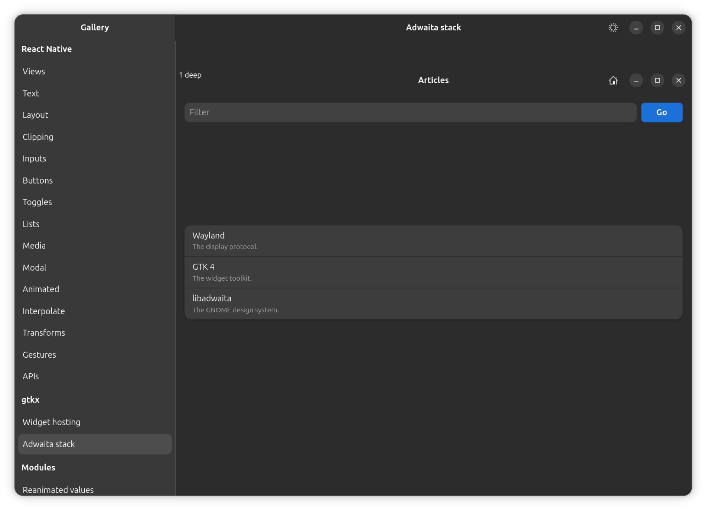
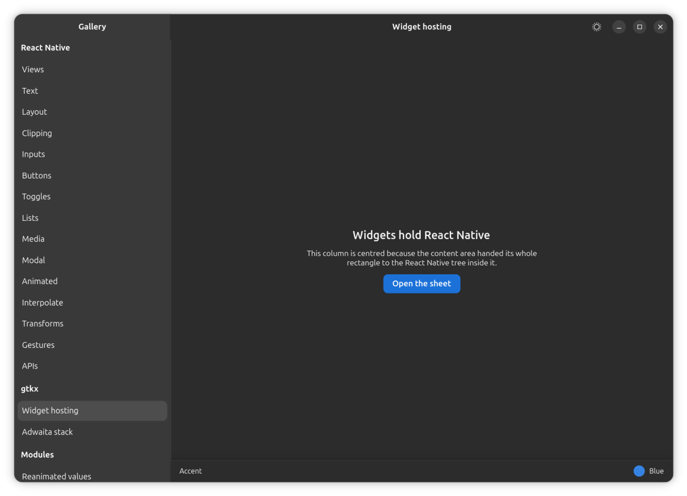
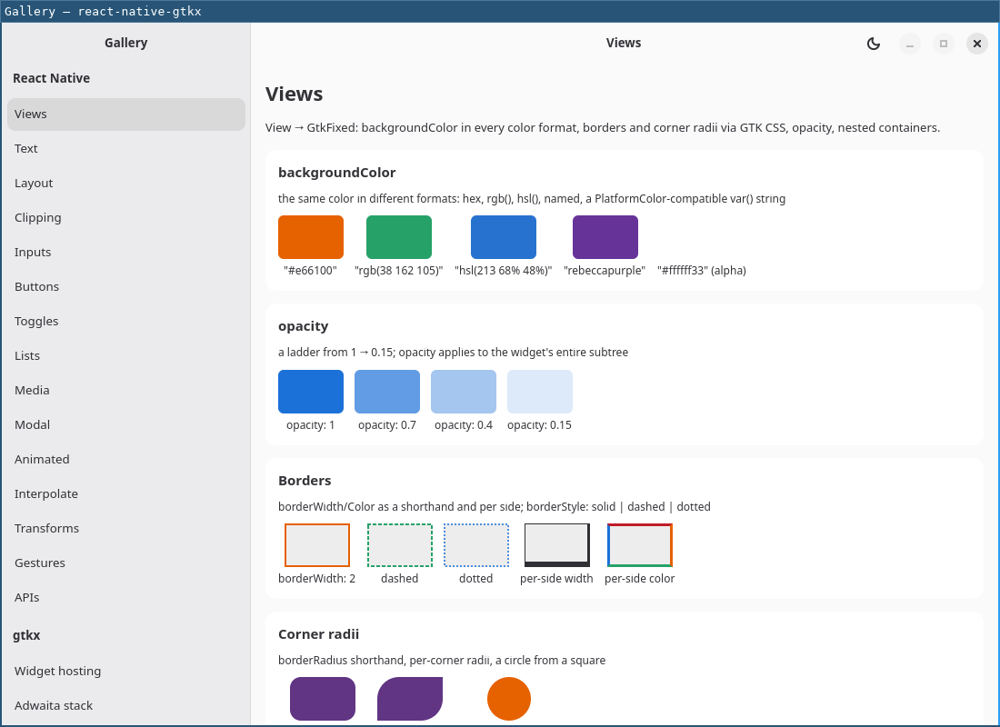

<p align="center">
  
</p>

<h1 align="center">react-native-gtkx</h1>

<p align="center"><b>React Native for the Linux desktop.</b><br/>
The <code>react-native</code> API, rendered as real GTK4/Adwaita widgets — no WebView,<br/>
no canvas, no bridge. Linux is a React Native out-of-tree platform here:<br/>
<code>npx react-native run-linux</code>, next to <code>run-ios</code> and <code>run-android</code>.</p>

<p align="center">
  <a href="https://github.com/itsmepetrov/react-native-gtkx/actions/workflows/ci.yml"></a>
  <a href="https://www.npmjs.com/package/react-native-gtkx"></a>
  <a href="https://github.com/itsmepetrov/react-native-gtkx/releases"></a>
</p>

Under the hood: [gtkx](https://github.com/gtkx-org/gtkx) (a React reconciler for GTK4, with an in-process FFI into libgtk) and [Yoga](https://yogalayout.dev) — the same flexbox engine React Native itself uses. Navigation runs on real Adwaita widgets: react-navigation's stack and drawer are backed by an actual `Adw.NavigationView`/`Adw.NavigationSplitView`, so the back button, the slide transition, Escape, the back gesture and the back-history menu are the platform's, not a JS re-implementation. Past the portable surface, `react-native-gtkx/gtk` and `/adw` hand you every GTK/Adwaita widget directly — including a navigation stack that needs no router at all.

|  |  |  |
| :--------------------------------------------------------------: | :--------------------------------------------------------------------------------: | :-----------------------------------------------------------------------------------: |

_From `examples/gallery`: a real `Adw.NavigationView` stack, a GTK widget's content area hosting React Native content, and the same sidebar-navigated app in light mode (Adwaita's light/dark theming, both ways)._

## Quickstart

```bash
npx degit itsmepetrov/react-native-gtkx/template my-app && cd my-app
npm install && npm run dev   # a window, with Fast Refresh
```

Adding Linux to an app that already ships iOS/Android is `npm install react-native-gtkx`, a one-line Metro config wrap, and `npx react-native run-linux` — see [installation](docs/guide/installation.md).

## Documentation

The full docs, including screenshots per component and a searchable reference, are published at [itsmepetrov.github.io/react-native-gtkx](https://itsmepetrov.github.io/react-native-gtkx/) (source in this repo's `docs/` tree):

- [Guide](https://itsmepetrov.github.io/react-native-gtkx/docs/guide/installation) — [installation](https://itsmepetrov.github.io/react-native-gtkx/docs/guide/installation), [your first app](https://itsmepetrov.github.io/react-native-gtkx/docs/guide/first-app), [Metro vs. vite toolchains](https://itsmepetrov.github.io/react-native-gtkx/docs/guide/toolchains), the [plain-GTK profile](https://itsmepetrov.github.io/react-native-gtkx/docs/guide/plain-gtk), [packaging](https://itsmepetrov.github.io/react-native-gtkx/docs/guide/packaging) (debs, standalone).
- [Reference](https://itsmepetrov.github.io/react-native-gtkx/docs/reference) — every component and API, each with its GTK/Adw badge and its differences from React Native.
- [Architecture](https://itsmepetrov.github.io/react-native-gtkx/docs/architecture/overview) — [overview](https://itsmepetrov.github.io/react-native-gtkx/docs/architecture/overview) (the reconciler-to-gtkx path, the widget surface), [layout and styling](https://itsmepetrov.github.io/react-native-gtkx/docs/architecture/layout-and-styling) (the Yoga shadow tree, the style split), [gestures](https://itsmepetrov.github.io/react-native-gtkx/docs/architecture/gestures), and [window/navigation/settings integration](https://itsmepetrov.github.io/react-native-gtkx/docs/architecture/integration).
- [gtkx upstream agenda](docs/upstream-gtkx.md) — the standing agenda for gtkx itself.
- [CONTRIBUTING](CONTRIBUTING.md) — developing the library from macOS, via a Linux VM.

## Requirements

Linux, GTK4 ≥ 4.20, libadwaita ≥ 1.8, Node.js ≥ 24.

## License

MIT
