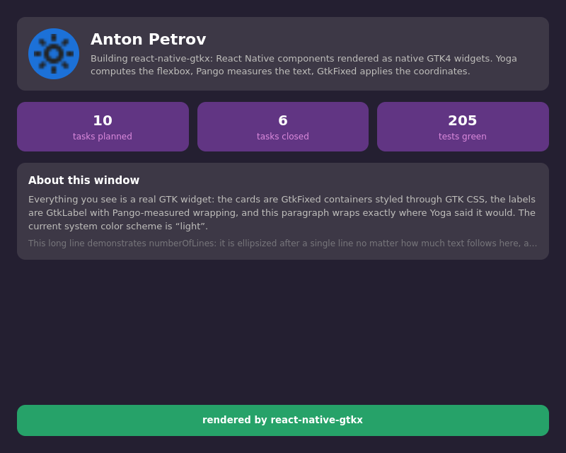

# react-native-gtkx

**React Native for the Linux desktop.** Write apps against the familiar React Native API (`View`, `Text`, `StyleSheet`, flexbox) — they run as native GNOME applications on real GTK4/Adwaita widgets, with no WebView and no canvas rendering.

Under the hood: [gtkx](https://github.com/gtkx-org/gtkx) (a React reconciler for GTK4 on Node.js) + [Yoga](https://yogalayout.dev) (the RN flexbox engine). The model follows react-native-web: a compatibility layer on top of another renderer, with the `react-native` → `react-native-gtkx` alias provided by the Metro preset (Linux as a standard RN [out-of-tree platform](https://reactnative.dev/docs/out-of-tree-platforms) — `npx react-native run-linux` next to `run-ios`/`run-android`) or by the vite preset for Linux-first projects.

_The `examples/profile` demo: not a single `@gtkx/*` import — only `react-native`. Every rectangle is a real GTK widget; Yoga computes the flexbox layout, Pango measures the text._

The same source built with react-native-web ([portability proof](docs/shots/profile-web.png)) — structurally identical.

## Status

- [x] Yoga + GtkFixed spike — **GO** (0 px accuracy, 500-node reflow in 0.17 ms, 60 fps — `spike/RESULTS.md`)
- [x] Dev environment (Docker/VM, GTK 4.22, live VNC) and CI workflow
- [x] gtkx bridge (isolation from the RC API; [rc.1 workaround catalog](docs/gtkx-rc1-vs-main.md))
- [x] Layout engine (Yoga shadow tree, measure via Pango, batching, diffing, onLayout)
- [x] StyleSheet: layout/visual split, CSS Color 4 colors, PlatformColor → Adwaita
- [x] View / Text / Image / AppRegistry — first RN render in GTK
- [x] Platform / Dimensions / Appearance / AppState / Alert / Linking (+ hooks)
- [x] Pressable / TouchableOpacity / TextInput / ScrollView / FlatList / Switch / Modal / Animated
- [x] Vite preset (alias, platform extensions) + project template (install → window in 63 s)
- [x] Component gallery and documentation
- [x] Windowed lists: virtualization (10k rows), sticky headers, SectionList, scrollToIndex, viewability, inverted (RN chat semantics), refresh parity
- [x] Linux as an RN **out-of-tree platform**: the standard Metro/Babel toolchain, `react-native.config.js` declared by the dependency, `npx react-native run-linux`, compiled package distribution (attw-checked) — see `examples/rn-app` (a cli-init app with ios + android + linux)
- [x] **Fast Refresh on both toolchains**: `run-linux --dev` (Metro dev server + HMR in the GTK host, state preserved) and `gtkx dev` (vite)

Verified live: `examples/gallery` (the whole surface) and the interactive `examples/playground` — 352 tests (unit + component tests under headless Wayland).

## Performance architecture

There is no "bridge tax" here. React Native's historic bottleneck — JSON
batches serialized between the JS and native threads — does not exist in this
architecture: gtkx binds GTK through an in-process FFI (NAPI-RS), so a widget
call is a synchronous C call on the same thread, with numbers and pointers
marshalled directly. That is the same direction React Native itself took with
JSI/Fabric, where Yoga and view commits run through direct synchronous calls.

Layout math runs in Yoga compiled to WASM (near-native speed): a 500-node
reflow measures at 0.13–0.17 ms. The GTK side is driven by our own
GtkLayoutManager subclass; a full measure+allocate pass over a 50-child
container costs ~0.21 ms including every FFI hop. Animation frames bypass
layout entirely — an Animated value write is a WeakMap store plus one queued
GTK allocation. Two orders of magnitude of headroom against a 60 fps frame
budget, measured, not estimated (see spike/RESULTS.md and
spike/layout-manager/FINDINGS.md).

## Documentation

- [Getting Started](docs/getting-started.md) — a new project in a minute, and adding Linux to an existing RN app;
- [API v1](docs/api.md) — the full surface and differences from RN;
- [CONTRIBUTING](CONTRIBUTING.md) — developing the library (including from macOS via a remote container).

## Requirements

Linux, GTK4 ≥ 4.20, libadwaita ≥ 1.8, Node.js ≥ 22.15 (24 recommended).

## License

MIT
