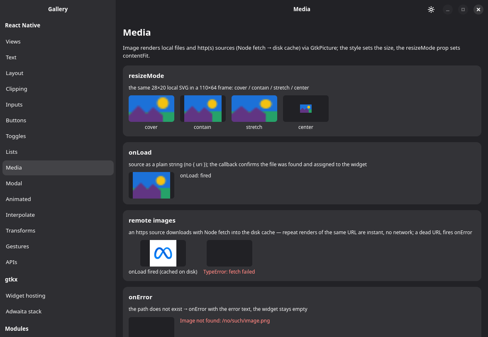

# Image

**Profile:** GTK · **Backed by:** `GtkPicture`

Supported props:

- `source={{ uri }}` or a string — local paths, `file://` and `http(s)`
  (fetched through Node and cached to disk by URL, with in-flight requests
  de-duplicated).
- `resizeMode` — `cover` / `contain` / `stretch` / `center`.
- `onLoad` / `onError`; a ref exposing the geometry methods (`ImageHandle`).
- `.svg` files load like any other image (rasterized through librsvg).
  Building vector graphics from state instead of a file is a separate
  import — see [Svg](../svg.md).

Differs from react-native:

- A remote image has no synchronous size — `style` sets the size, as in RN.
- The disk cache is not size-limited yet.
