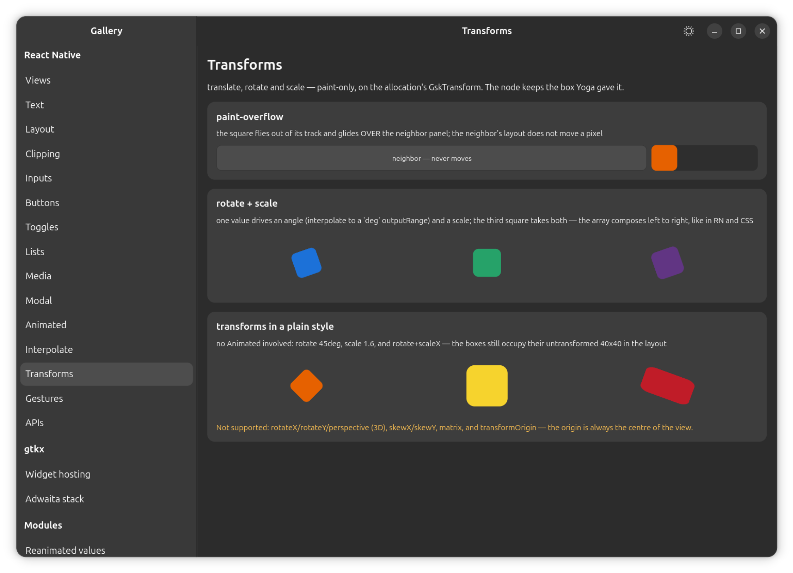

# Components

The portable component surface: `View`, `Text`, `Image` and the structural
extensions around them, the input and pressable family, the scrolling and
list family, and `Modal` — every host component this platform renders as a
native GTK widget. Import all of them from `"react-native"`; the aliasing
that resolves that specifier to this package is set up by the Metro or vite
preset (see [Package aliases](../aliases.md)).

- [View](view.md)
- [Text](text.md)
- [Image](image.md)
- [SafeAreaView](safe-area-view.md)
- [StatusBar](status-bar.md)
- [ActivityIndicator](activity-indicator.md)
- [Root](root.md)
- [NestedRoot](nested-root.md)
- [IntrinsicRoot](intrinsic-root.md)
- [TextInput](text-input.md)
- [Switch](switch.md)
- [Pressable](pressable.md)
- [TouchableOpacity](touchable-opacity.md)
- [TouchableHighlight](touchable-highlight.md)
- [TouchableWithoutFeedback](touchable-without-feedback.md)
- [ScrollView](scroll-view.md)
- [FlatList](flat-list.md)
- [SectionList](section-list.md)
- [VirtualizedList](virtualized-list.md)
- [Modal](modal.md)

`Animated.View` — the animated variant of `View`, driving `opacity` and
`transform` (and, conditionally, position and size) from `Animated` nodes
without a React re-render — is documented with the rest of the `Animated`
API in [APIs](../apis.md#animated), since both come from the same import.

## Layout, paint and hit-testing

A few rules apply across every component in this section rather than to one
of them:

- **`zIndex` orders paint and picking, per sibling group.** GTK4 has no
  z-order property, so the container widget provides it: children are
  allocated in their Yoga order and painted (snapshotted) in `zIndex` order,
  and a widget a higher-painting sibling covers declines to be hit-tested, so
  input follows the pixels. Layout itself is untouched — only the paint pass
  is sorted. The rules match RN, each checked rather than assumed: `zIndex`
  applies whatever the component's `position` is (CSS requires a non-`static`
  position; neither RN nor this platform does); equal values keep document
  order (the sort is stable); `undefined` behaves as `0`, and negative values
  are legal and paint below untagged siblings; and the ordering is **scoped to
  one sibling group** — it creates no stacking context that escapes the
  parent, so a child can never paint above its parent's own siblings. That
  last rule is what to design around: to lift a dragged item over a drop
  target, put the `zIndex` on the dragged item's row, exactly as on iOS and
  Android. `Animated.View` and `useAnimatedStyle` reorder on the same terms as
  `opacity` — one widget write, no Yoga pass.

  One divergence from RN: an interactive native leaf inside a covered
  sibling — a `TextInput`, a `Switch`, a `ScrollView` viewport, a raw GTK
  widget in a slot — still receives a press even where a raised view visually
  covers it, because GTK's per-point hit test is consulted after a widget's
  children regardless of paint order. `Text` and `Image` do not have a press
  prop of their own, so while something is raised above them they are
  excluded from hit-testing and the press reaches their nearest `View`
  instead — which is also why a `pointerEvents: "box-none"` `View` whose only
  child is `Text` lets a press fall through to whatever is behind it, while a
  sibling in that same container stays raised.

- **`transform` is paint-only, like RN.** `translateX`/`translateY`, `scale`,
  `scaleX`, `scaleY` and `rotate`/`rotateZ` apply to any component's style,
  not just `Animated.View`; the array composes left to right, as in RN and
  CSS, and the origin is always the component's own center. A transformed
  child draws past its container and over siblings — later siblings stay on
  top unless `zIndex` says otherwise — without moving any ancestor, and input
  follows the transform: a rotated view is clickable in its rotated shape,
  unless a container's `overflow: "hidden"` clips it at the edge exactly as it
  clips an untransformed child. Not supported: 3D transforms (`rotateX`,
  `rotateY`, `perspective`), `skewX`/`skewY`, `matrix`, and `transformOrigin`
  (the origin is always centered).

- **Animations never auto-stop.** The desktop's own "reduce animations"
  preference is not applied automatically — GTK-side animations stay on to
  match `Animated`, which runs on its own timers regardless of that setting.
  Honoring reduced motion is an app-level opt-in, exactly as it is in RN.

See [Styling](../styling.md) for the full style-property reference (what
reaches Yoga, what reaches GTK CSS, and what `overflow` does at the boundary
between the two).
