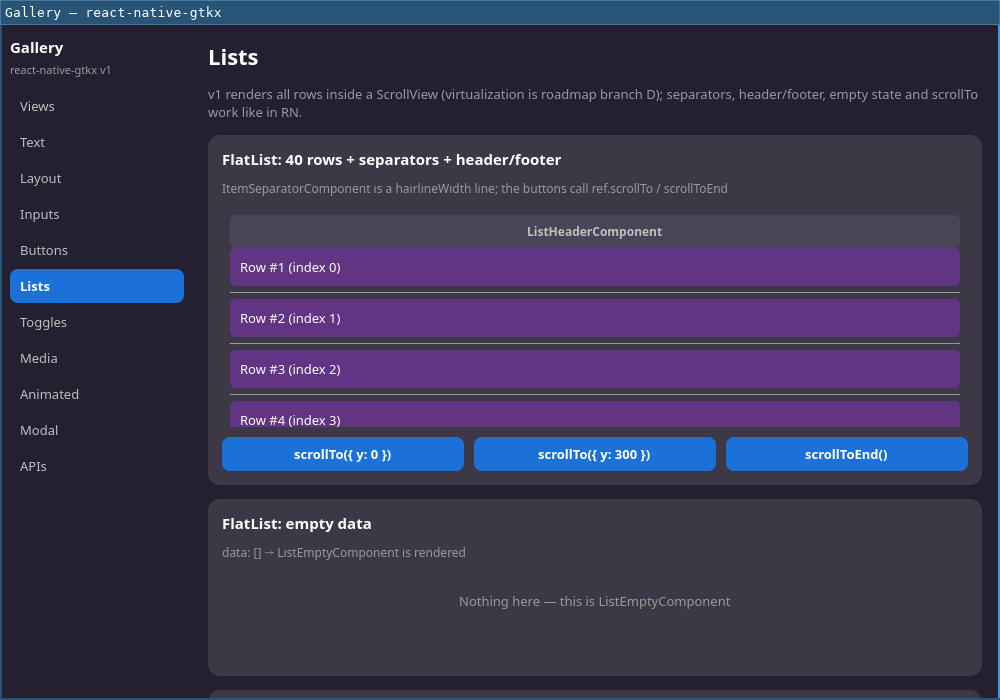

# SectionList

**Profile:** GTK · **Backed by:** built on `FlatList`

Supported props: `sections`, `renderSectionHeader`, sticky section headers
by default (`stickySectionHeadersEnabled`).

Differs from react-native:

- Viewability props are not exposed yet (section-aware `ViewToken`s are not
  implemented).
