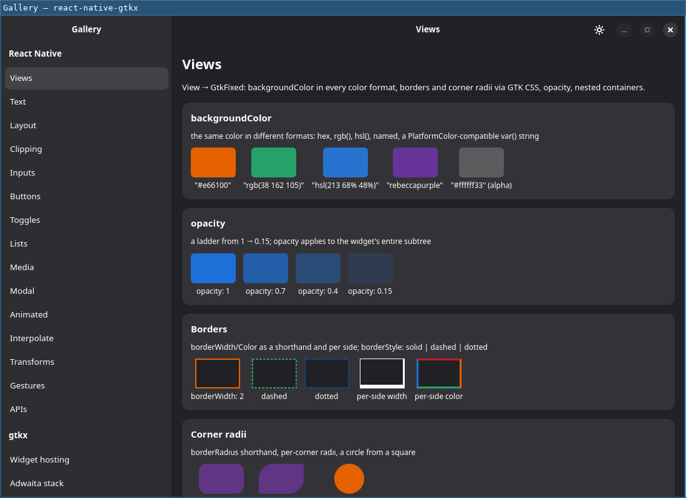

# Navigation

`react-native-gtkx/navigation` is a [react-navigation](https://reactnavigation.org)
stack and sidebar navigator built on `Adw.NavigationView` and
`Adw.NavigationSplitView` — native Adwaita page transitions, header bar back
buttons and back gestures stay in sync with react-navigation state.

The subpath requires `"Adw-1"` in the app's `gtkx.config.ts` `libraries`
unconditionally. Importing it in an app that has not declared `"Adw-1"`
throws immediately, naming the fix; the Guide's plain-GTK profile page
covers what other subpaths do instead in that configuration.

## Requirements

The package peers optionally on `@react-navigation/native` (v8), which must
be installed alongside it.

`@react-navigation/native@8` itself peers on `react-native: "*"` — unlike
`@react-navigation/core@8`, which declares no `react-native` peer at all. An
app with no `react-native` package anywhere in its tree (a vite+gtkx app
with no Metro side, for example) gets an unmet-peer-dependency warning from
`npm install` for it. The warning is harmless: react-native-gtkx never
imports anything from the `react-native` package, so nothing at runtime
actually needs it present.

`react-native-gtkx/navigation` exports exactly two factories —
`createStackNavigator` and `createSidebarNavigator` — and the option/prop/
event types around them. The rest of the react-navigation surface
(`useNavigation`, `useRoute`, `useFocusEffect`, `useIsFocused`,
`useNavigationContainerRef`, `CommonActions`, `StackActions`,
`usePreventRemove`, `NavigationContainer`, and everything else) comes from
`@react-navigation/native` directly, not from this package.

## Window chrome

Both navigators' header bars stand in for the window's own title bar, so
the app should run with content chrome:

```tsx
AppRegistry.runApplication(name, { ..., chrome: "content" })
```

Running with the default system chrome instead doubles the title bar,
since the pages already bring their own header bars. In that case, each
navigator logs a one-time development warning naming the fix.

## Stack navigator


_This demo bypasses react-navigation entirely (its own `useState` router); it
only proves the underlying native primitive the stack navigator above is
built on._

`createStackNavigator()` returns a `Navigator`/`Screen` pair used the same
way as `@react-navigation/native-stack`'s:

```tsx
import { NavigationContainer } from "@react-navigation/native"
import { createStackNavigator } from "react-native-gtkx/navigation"

const Stack = createStackNavigator()

const App = () => (
  <NavigationContainer>
    <Stack.Navigator>
      <Stack.Screen
        name="Home"
        component={HomeScreen}
      />
      <Stack.Screen
        name="Details"
        component={DetailsScreen}
        options={{ title: "Details page" }}
      />
    </Stack.Navigator>
  </NavigationContainer>
)
```

### Screen options

- **`title`** (`string`, default: route name) — Header bar title.
- **`headerShown`** (`boolean`, default `true`) — Shows the header bar for
  this screen.
- **`headerButtons`** (`HeaderButton[]`) — Native buttons packed at the end
  of the header bar, after `headerRight`. Each button is `{ id, icon,
tooltip, onPress }`; `icon` is an Adwaita symbolic icon name.
- **`headerLeft`** (`() => ReactNode`) — Content packed at the start of the
  header bar, in an intrinsic-size layout root — the content's own Yoga
  size is the slot size.
- **`headerRight`** (`() => ReactNode`) — Content packed at the end of the
  header bar, before `headerButtons`.
- **`gestureEnabled`** (`boolean`, default `true`) — `false` disables the
  native back button, Escape and the back gesture for this screen.
  Programmatic `goBack` still works; this is also the mechanism behind
  `usePreventRemove` — a prevented route reports the same disabled state,
  so no native pop can race react-navigation state, and the route pops
  once the app lifts the guard.
- **`animation`** (`string`, default `"default"`) — Differs from
  react-navigation: GTK has exactly one transition style, so this
  collapses to a boolean. `"none"` turns transitions off; any other value
  — including native-stack's own style names such as
  `"slide_from_bottom"` or `"fade"` — turns transitions on and plays the
  standard Adwaita transition instead of the one requested. A
  non-`"none"`/`"default"` value still animates (it is not silently
  treated as `"none"`) and logs a development warning once.

`animation` is a property of the whole view, not a per-page one, so there
is no per-screen granularity: the value used is read from whichever screen
is currently on top of the visible stack, recomputed on every navigation.
Setting it once via `screenOptions` — the same value for every screen — is
the reliable way to use it; the per-screen case only matters when
different screens genuinely disagree, and even then only the active
screen's value is observed. Interactive swipe-back gestures always animate
regardless of this setting, an Adwaita behavior that is not overridable
here.

When `headerShown` is `false`, the screen's content fills the page
directly, with no header bar; otherwise it renders inside the header bar's
content area. Each screen mounts its own layout root inside the page, so
the page's content allocation is exactly that screen's viewport.

Differs from react-navigation: a full custom header replacement
(`@react-navigation/native-stack`'s `header` option) is not implemented —
`headerLeft`, `headerRight` and `headerButtons` compose within the
standard header bar instead. Deep-link `url` events never fire on
desktop; see [`apis.md`](./apis.md) for `Linking`.

### Transition events

The stack navigator emits two events on a screen's `navigation` object,
matching `@react-navigation/stack` and `@react-navigation/native-stack`:

- **`transitionStart`** (`{ data: { closing: boolean } }`) — Fires when a
  push/pop/replace transition starts, once per involved route (not once
  per gesture or tap). `closing` is `false` for the route becoming
  visible, `true` for the route leaving the visible stack.
- **`transitionEnd`** (`{ data: { closing: boolean } }`) — Fires when the
  transition settles. Tied to `AdwNavigationPage`'s own `shown`/`hidden`
  signals: it fires on `shown` for the entering screen and on `hidden` for
  the leaving screen. `transitionDuration` (default 400 ms) is a fallback
  only, used when a page's own signal never arrives — a signal-less
  environment, or an intermediate screen skipped entirely by a multi-hop
  pop. When transitions are not animated, the real signals still fire
  immediately, so `transitionEnd` is never delayed by the fallback window.

A screen that stays mounted without actually entering or leaving the
visible stack — the screen underneath a push, for example — receives
neither event, matching upstream.

Differs from react-navigation: native pops (the back button, Escape, the
back gesture) do not fire either event today. A user-driven pop is
handled by the widget itself before the adapter is told about it, so there
is nothing to hook a `transitionStart` into; only programmatic navigation
(`navigate`, `goBack`, `dispatch`, …) fires these events.

## Sidebar navigator

`createSidebarNavigator()` is the desktop equivalent of a drawer navigator,
built on `Adw.NavigationSplitView`: a persistent native sidebar (an
`AdwActionRow` per screen, in a `GtkListBox` with Adwaita's
`navigation-sidebar` styling) selects between parallel screens — `TabRouter`
semantics, not a stack.

```tsx
import { createSidebarNavigator } from "react-native-gtkx/navigation"

const Sidebar = createSidebarNavigator()

const App = () => (
  <NavigationContainer>
    <Sidebar.Navigator sidebarTitle="Mail">
      <Sidebar.Screen
        name="Inbox"
        component={InboxScreen}
        options={{ icon: "mail-symbolic" }}
      />
      <Sidebar.Screen
        name="Trash"
        component={TrashScreen}
        options={{ icon: "user-trash-symbolic" }}
      />
    </Sidebar.Navigator>
  </NavigationContainer>
)
```

### Navigator props

- **`sidebarTitle`** (`string`, default `"Sidebar"`) — Title of the
  sidebar pane's header bar.
- **`headerButtons`** (`HeaderButton[]`) — Buttons packed at the end of the
  content header bar; a screen's own `headerButtons` option overrides this
  entirely for that screen.
- **`sidebarHeaderLeft` / `sidebarHeaderRight`** (`() => ReactNode`) —
  Content packed at the start/end of the sidebar pane's own header bar —
  distinct from the content header's `headerLeft`/`headerRight`, which are
  per-screen options, because one sidebar pane is shared by every screen.
  Mounted through the same intrinsic content root as the content header,
  so it lays out as a horizontal, content-hugging cluster flush with
  natively packed buttons.
- **`sidebarHeaderTitle`** (`() => ReactNode`) — Replaces the sidebar
  header bar's title widget (a search entry, a switcher). Left unset,
  `sidebarTitle` renders as a plain label.
- **`collapseWidth`** (`number`, sp; unset by default) — Width below which
  the split view collapses to the sidebar or the content pane alone,
  through a native `Adw.Breakpoint`. Unset by default: no breakpoint is
  mounted at all, so an app that never sets this sees no behavior change.
- **`minWidth` / `minHeight`** (`number`, px; default `360` / `294`) — The
  narrowest size the sidebar navigator's UI supports, applied to the
  breakpoint container `collapseWidth` mounts. Ignored when
  `collapseWidth` is unset, since no container exists then. The default is
  GNOME's own adaptive floor.
- **`sidebarContent`** (`(props: SidebarContentProps) => ReactNode`) —
  Replaces the entire sidebar pane body.

`collapseWidth` is not driven by React state or `useWindowDimensions`: the
property flip happens inside GTK's own allocation pass, at no cost of a
React render for the resize itself.

Adwaita cannot measure a breakpoint container on its own — what it holds
changes with the breakpoints — so it otherwise reports a minimum size of
zero and warns that a width/height request must be set. Left at the
default, this is not an issue; an app whose content header bar needs more
room than the default (a segmented control as `headerTitle`, for example,
costs roughly 110 px on its own and cannot ellipsize the way a plain title
label can) must raise `minWidth`/`minHeight` — measured against the pane's
own content, not guessed. Setting it too low does not fail loudly: the
window resizes past what the pane can draw, and Adwaita clips the pane
instead of adapting it (an `AdwNavigationSplitView exceeds
AdwBreakpointBin width` message in the system journal, felt as content
running off the edge). The sidebar pane's own width is separately bounded
between 180 and 280 px regardless of `collapseWidth`.

### Screen options

- **`title`** (`string`, default: route name) — Sidebar row and content
  header bar title.
- **`icon`** (`string`) — Adwaita symbolic icon name for the row's prefix.
  Ignored when `color` is also set — a row shows a colored dot or an icon,
  never both.
- **`color`** (`string`) — CSS color for a colored-dot prefix, replacing
  `icon`. `color` wins when both are set.
- **`count`** (`number`) — Badge shown as the row's suffix. Hidden when
  `0` or unset.
- **`headerLeft` / `headerRight`** (`() => ReactNode`) — Content header bar
  start/end, per screen — a filter toggle group for a list, a back button
  plus star/trash for an open item.
- **`headerTitle`** (`() => ReactNode`) — Replaces the content header
  bar's title widget for this screen. Left unset, the header bar shows the
  page's own title automatically.
- **`headerButtons`** (`HeaderButton[]`) — Overrides the navigator-level
  `headerButtons` prop for this screen.
- **`contentLayout`** (`"react-native" | "widget"`, default
  `"react-native"`) — What the screen's body is. `"react-native"` mounts
  it in a Yoga layout root that fills the pane, so `<View style={{ flex:
1 }}>` behaves the way it does anywhere else. `"widget"` packs the body
  into the page directly, with no layout root in between, for a screen
  whose body is a GTK widget tree — GTK's own sizing (`vexpand`, a list's
  natural height) then applies normally. Under the default, a widget tree
  collapses instead, and quietly: every widget becomes a single Yoga leaf
  measured for its own natural size, so the container renders its first
  child, drops the rest, and reports the roughly 1 px it can shrink to,
  with no error anywhere. Mixing is per screen, not per subtree — a
  `"widget"` screen that wants React Native content somewhere inside it
  wraps that part in `SlotContent` itself.
- **`sidebarRow`** (`() => ReactNode`) — Draws the row directly instead of
  letting `title`/`icon`/`color`/`count` compose one. See
  [Building sidebar rows](#building-sidebar-rows) below.
- **`group`** (`string`) — Section this row belongs to. See
  [Grouping rows](#grouping-rows) below.

A screen changes its own header shape from inside itself by calling
`navigation.setOptions({ headerLeft, headerRight, headerTitle })` in an
effect keyed on whatever local state decides the shape — no navigator API
beyond the options themselves is involved. `setOptions` merges into the
previously resolved options rather than replacing them: a call that omits
`headerRight` does not clear a `headerRight` a previous call set, it
leaves it in place. A screen that flips between header shapes must give
every one of `headerLeft`, `headerRight`, `headerTitle` and `headerButtons`
an explicit value on every call — `undefined` counts as a real overwrite,
an absent key does not.

### Building sidebar rows

There are three ways to put content in the sidebar, cheapest first — the
same ladder react-navigation's own `tabBarIcon` → `drawerLabel` →
`drawerContent` climbs:

1. **`title` / `icon` / `color` / `count`** — the convenience. Composes an
   `AdwActionRow` automatically.
2. **`sidebarRow`** (screen option) — draw one row yourself. The navigator
   keeps owning row behavior: selection, click → `jumpTo`, staying in step
   with navigation state, the collapsed reveal. Return anything a
   `GtkListBoxRow` can hold — React Native content, GTK widgets, a
   differently configured Adwaita row.
3. **`sidebarContent`** (navigator prop) — draw the whole pane, routing
   surface included:

```tsx
<Sidebar.Navigator
  sidebarContent={({ routes, focusedIndex, jumpTo }) => (
    <View style={{ flex: 1 }}>
      <SearchField onSubmit={filterRoutes} />
      <ScrollView style={{ flex: 1 }}>
        {routes.map((route, index) => (
          <Pressable
            key={route.key}
            onPress={() => jumpTo(route.name)}
          >
            <Text
              style={{
                padding: 8,
                fontWeight: index === focusedIndex ? "700" : "400",
              }}
            >
              {route.title}
            </Text>
          </Pressable>
        ))}
      </ScrollView>
      <StorageUsageFooter />
    </View>
  )}
>
  <Sidebar.Screen
    name="Inbox"
    component={InboxScreen}
  />
  <Sidebar.Screen
    name="Trash"
    component={TrashScreen}
  />
</Sidebar.Navigator>
```

`SidebarContentProps` carries `routes` (each with `key`, `name`, resolved
`options`, resolved `title`, and `focused`), `focusedIndex`, and
`jumpTo(name)`. `route.title` is already resolved (`options.title`, falling
back to the route name). `jumpTo` reveals the content pane when collapsed,
the same as a native row click — use it rather than dispatching directly,
so selection cannot drift from navigation state. The pane's header bar and
`sidebarTitle` still belong to the navigator; `sidebarContent` replaces only
the body under it. A sidebar built from GTK widgets instead of React
Native content wraps its own tree in `WidgetContent`, the same escape
hatch `contentLayout: "widget"` uses for a screen body.

The reason rungs 2 and 3 exist at all: `AdwActionRow` carries Adwaita's own
row metrics, not a default this package picked — measured at roughly
104 px per row (with a prefix and/or count laid out) against roughly 40 px
for a plain title-only row — and nothing passed to
`title`/`icon`/`color`/`count` changes that height. A screen on rung 1 has
no lever for it; a different height or density means climbing to
`sidebarRow` or `sidebarContent`.

### Grouping rows




_The gallery's own screenshots elsewhere on this site are all native
GNOME/Adwaita chrome in the dark theme — this pair is the one deliberate
light/dark comparison._

Consecutive screens sharing a `group` value get one Adwaita section header
above the first of them. The header is a decoration owned by the row below
it, not a row of its own — it sits outside the list's selection model and
outside its focus chain, so arrow keys and Tab walk past it and assistive
technology never announces a row that cannot be activated.

Grouping follows row order: screens in one group must be declared
together, and a group name reappearing after a gap starts a second header
rather than reordering anything. Leaving `group` unset on every screen —
the default — keeps the list flat.

### Collapsing

Any route becoming active while collapsed reveals content
(`AdwNavigationSplitView`'s `showContent`, a plain native property write,
not React state) — a row click or a programmatic `navigate()`/`jumpTo()`;
the native back button that then appears reverses it. Re-selecting the
same, already-active row also reveals content again, since GTK's
`row-selected` does not refire for a re-click with no selection change.

Resizing back above `collapseWidth` and then below it again does not reset
the selection or which pane is showing — both simply persist across the
round trip, the same size-class behavior a mobile master-detail app relies
on.

### Sidebar transition events

- **`sidebarShown`** (`{ data: undefined }`) — Fires when the split
  view's own back affordance (back button, Escape, back gesture) hides the
  content pane while collapsed, returning to the sidebar.

Differs from react-navigation: this is the one case where a native,
user-driven interaction does get an event. Unlike a stack pop, nothing is
removed from `TabRouter`'s state when this happens — the same route stays
focused, only the visible pane changes — so there is no state change for
an app to observe any other way. `sidebarShown` fires on the currently
active route, never for content being revealed (that direction is already
an ordinary state change), and never at all when `collapseWidth` is unset.

## Typed factories

`createStackNavigator<ParamList>()` and `createSidebarNavigator<ParamList>()`
are generic: the returned `Navigator`/`Screen` pair is typed against
`ParamList`, so a mistyped screen name or a mismatched param type is caught
at the JSX call site. Each factory has its own screen-props helper for a
component that reads `route`/`navigation` directly as props —
`StackScreenProps<ParamList, RouteName>` for the stack navigator,
`SidebarScreenProps<ParamList, RouteName>` for the sidebar navigator — and
its own navigation-helpers type for a component that instead reaches its
navigation object through `useNavigation()` (one `component` shared across
several routes, for example): `useNavigation<StackNavigationHelpers>()` /
`useNavigation<SidebarNavigationHelpers>()`.

Exported types: `StackNavigationOptions`, `StackNavigationEventMap`,
`StackNavigationHelpers`, `StackScreenProps`, `StackScreenConfig`,
`TypedStackNavigator`, `SidebarNavigationOptions`,
`SidebarNavigationEventMap`, `SidebarNavigationHelpers`,
`SidebarScreenProps`, `SidebarScreenConfig`, `TypedSidebarNavigator`,
`SidebarContentProps`, `HeaderButton`.

## Unsupported screen options

react-navigation's own navigator factory is untyped upstream, so neither
TypeScript nor the runtime otherwise says anything about a screen option
this adapter does not recognize (a `@react-navigation/native-stack` option
that does not apply here, for instance). Each navigator instead logs one
development-only warning per unknown option key, naming the option and why
it is ignored — for example, `headerStyle`/`headerTintColor`/
`headerTitleStyle` are ignored because Adwaita's theme owns the chrome
styling on this platform, `presentation` is ignored because only `"card"`
exists today, and `detachInactiveScreens`/`freezeOnBlur`/`inactiveBehavior`
are ignored because pushed pages always stay mounted, with no unmount/
freeze knob to offer. The warning fires once per navigator kind per key,
not once per screen or per render, and never in production.
