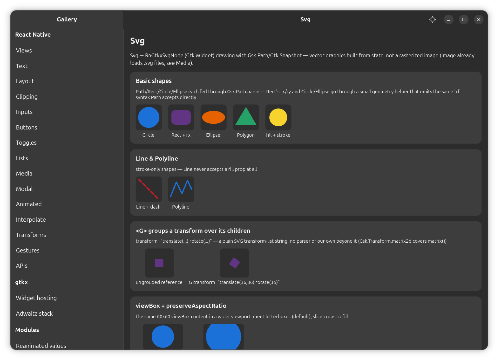

# Svg (`react-native-gtkx/svg`)

Vector graphics built from React state, in the shape of
[react-native-svg](https://github.com/software-mansion/react-native-svg) — the
de-facto standard RN mirrors for SVG — rather than a shape invented from
scratch. Drawing goes through `Gsk.Path`/`Gtk.Snapshot` on a single custom
widget (the same mechanism the layout and viewbox widgets use internally),
not a rasterized image.

`Svg` and everything in this reference are exported only from
`react-native-gtkx/svg`, never from the main `react-native-gtkx` entry point.
`react-native-svg` is a separate package on every other React Native
platform — RN itself has no built-in `Svg` — so this project mirrors that
split instead of folding `Svg` into the main export surface, which would make
code written against it fail to compile anywhere else.

```tsx
import Svg, { Circle, G, Path, Rect } from "react-native-svg"

const Icon = () => (
  <Svg
    width={24}
    height={24}
    viewBox="0 0 24 24"
  >
    <Circle
      cx={12}
      cy={12}
      r={10}
      fill="#1c71d8"
    />
    <Path
      d="M8 12 l3 3 l5 -6"
      stroke="white"
      strokeWidth={2}
      fill="none"
    />
  </Svg>
)
```



## Import and aliasing

`react-native-gtkx/svg` re-exports its component set in `react-native-svg`'s
own shape: `Svg` as both the default and a named export, everything else
named. The `react-native-gtkx/metro` and `react-native-gtkx/vite` presets
alias the bare `react-native-svg` package name onto this subpath
automatically, the same way they alias `react-native` itself, so portable
code that imports from `react-native-svg` runs unmodified. Apps using
neither preset can point their own bundler alias at `react-native-gtkx/svg`
by hand. `react-native-svg` itself is never a dependency of this package and
does not need to be installed — the alias works whether or not the real
package is present.

`react-native-gtkx/dnd` follows the exact same aliasing pattern for
`react-native-reanimated-dnd`; see [dnd.md](dnd.md) if drag-and-drop is also
part of the app being ported.

## `Svg`

The root component. It is a Yoga leaf, sized entirely by style/flex — like
`Image`, never by measuring the widget, so nothing here is intrinsic-sized.

| Prop                  | Behaviour                                                                                                       |
| --------------------- | --------------------------------------------------------------------------------------------------------------- |
| `width` / `height`    | Convenience props layered onto `style`, sizing the leaf.                                                        |
| `style`               | The general sizing/layout escape hatch, same as any other view.                                                 |
| `viewBox`             | `"minX minY width height"`. Reshapes the internal coordinate system exactly like real SVG — Yoga never sees it. |
| `preserveAspectRatio` | `xMin`/`xMid`/`xMax` × `YMin`/`YMid`/`YMax`, `meet`/`slice`, or `none`; defaults to `xMidYMid meet`.            |

Content always clips to the allocated bounds. There is no `overflow: visible`
opt-out.

## Shapes

- **`Path`** — `d` is handed straight to `Gsk.Path.parse()`, which
  understands SVG path syntax natively. There is no path parser of this
  project's own.
- **`Rect`** — `x`/`y`/`width`/`height`/`rx`/`ry`.
- **`Circle`** — `cx`/`cy`/`r`.
- **`Ellipse`** — `cx`/`cy`/`rx`/`ry`.
- **`Line`** — `x1`/`y1`/`x2`/`y2`. Stroke-only: there is no `fill` prop at
  all on `Line`, not even one that is silently ignored.
- **`Polygon`** / **`Polyline`** — `points`, either `"x,y x,y …"` or a space
  -separated equivalent; closed and open respectively.

Every shape other than `Path` is a small geometry helper away from the same
`d` syntax, so all of them end up drawn through that one `Gsk.Path.parse()`
call.

### Paint props

Every shape accepts the same paint props:

| Prop                                        | Behaviour                                                                                                                                                                      |
| ------------------------------------------- | ------------------------------------------------------------------------------------------------------------------------------------------------------------------------------ |
| `fill` / `stroke`                           | A static CSS color — hex, `rgb()`, `hsl()`, a named color, `transparent`, `none`, or `"url(#id)"` referencing a gradient. Defaults match SVG: `fill="black"`, `stroke="none"`. |
| `fillRule`                                  | `nonzero` \| `evenodd`.                                                                                                                                                        |
| `fillOpacity` / `strokeOpacity` / `opacity` | Independent opacity channels.                                                                                                                                                  |
| `strokeWidth`                               | Stroke thickness.                                                                                                                                                              |
| `strokeLinecap` / `strokeLinejoin`          | Line cap and join style.                                                                                                                                                       |
| `strokeDasharray` / `strokeDashoffset`      | Dash pattern and its offset.                                                                                                                                                   |

An unresolvable `url(#id)` reference paints nothing for that fill/stroke
rather than throwing.

## Grouping and transforms (`G`)

`G` groups children under an `opacity` and/or a `transform` string:
`translate()`, `scale()`, `rotate()`, `rotate(a, cx, cy)`, and `matrix()` —
the plain SVG transform-list syntax. `matrix()` maps directly onto
`Gsk.Transform.matrix2d()`.

Differs from react-native-svg: `skewX`/`skewY` and the structured
`transform={[{ translateX: ... }]}` array form that `Animated.View` accepts
elsewhere in this platform are not supported on `G` — only the string form.

## Gradients

`<Defs>` holds gradient definitions and must be a direct child of `Svg`;
nested `Defs` are not scanned.

- **`<LinearGradient id x1 y1 x2 y2>`** and **`<RadialGradient id cx cy r>`**
  take fractions from 0 to 1 by default (`gradientUnits="objectBoundingBox"`,
  mapped against the shape's own `Gsk.Path.getBounds()`).
  `gradientUnits="userSpaceOnUse"` uses the coordinates as-is instead.
- Each gradient holds **`<Stop offset stopColor stopOpacity>`** children.
  `offset` accepts either `0.5` or `"50%"`.

Differs from react-native-svg: there is no `gradientTransform`, and no
`spreadMethod` beyond the default pad behavior.

## Animated values

The numeric props above — shape geometry, `opacity`, `strokeWidth`,
`strokeDashoffset` — accept an `Animated.Value` or interpolation in place of
a plain number. A tick mutates the widget's paint state directly and calls
`queueDraw()`, the same bypass-React pattern `Animated.View` uses for
`transform`, on its own invalidation channel, since none of this touches
Yoga.

`G`'s `transform` string and `Path`'s `d` / `Polygon`/`Polyline`'s `points`
are not Animated-aware — they are strings, not numbers.

## Differs from react-native-svg

The shape set here — `Path`, `Rect`, `Circle`, `Ellipse`, `Line`, `Polygon`,
`Polyline`, `G`, gradients — covers icons, charts and indicators, which is
the overwhelming majority of real SVG usage. The following are not part of
the surface:

- No `SvgXml` / `SvgUri` — rasterizing an arbitrary SVG string or URI at
  runtime. Loading `.svg` **files** is a different, already-covered
  mechanism: `Image` loads them today, through its own rasterized-image
  path rather than this vector widget tree. See the components reference
  for that entry — it is not repeated here.
- No `<Text>` / `<TSpan>` / `<TextPath>` — text laid out along or inside a
  path.
- No `<Mask>`, `<ClipPath>`, SVG filters, `<Use>`, `<Symbol>`, or
  `<Pattern>`.

None of these have a real consumer yet in this platform's own apps.
