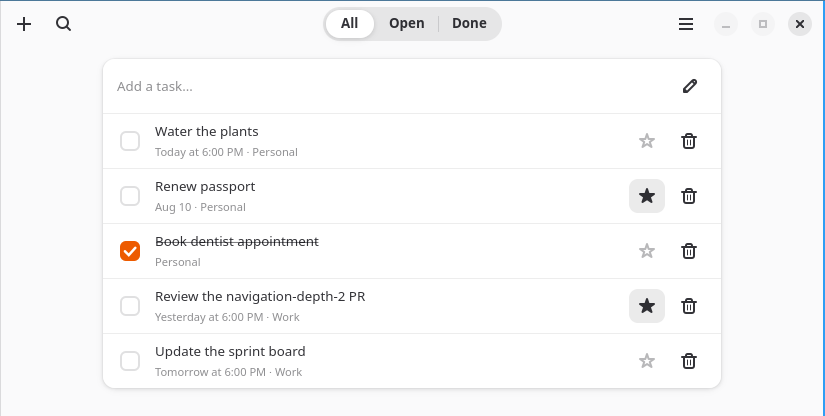
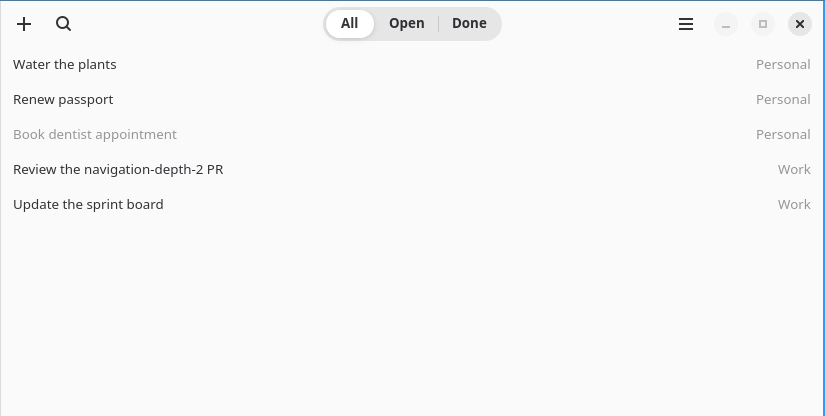
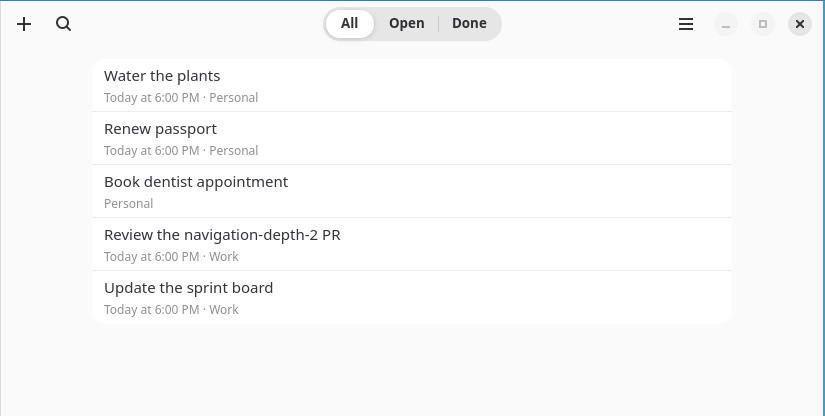
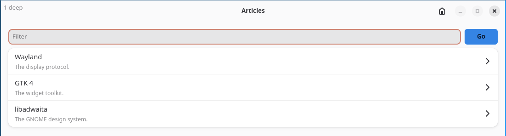
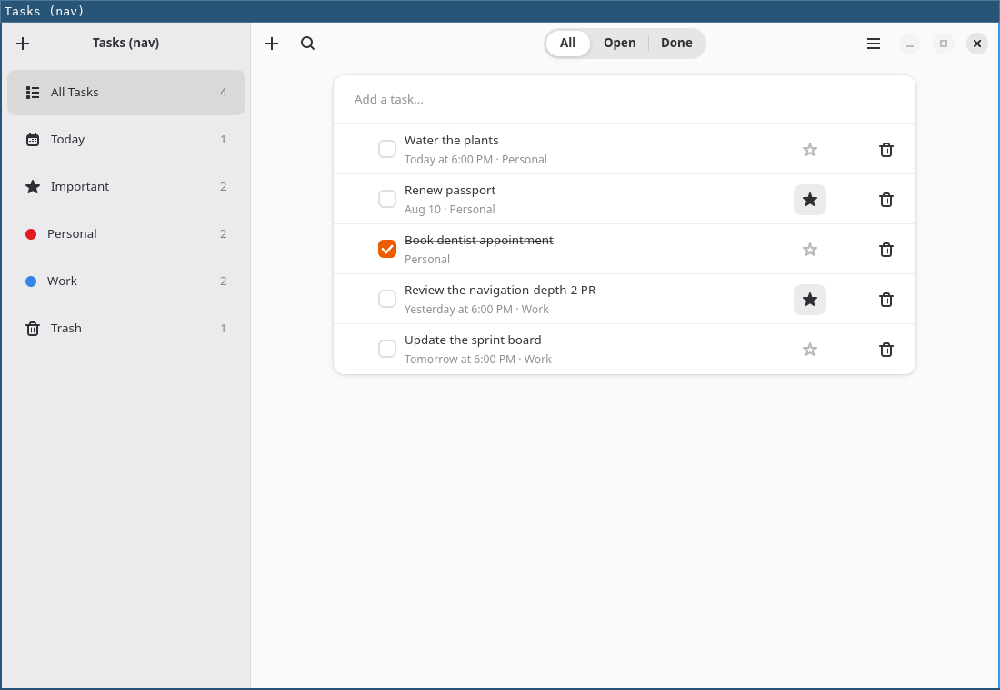
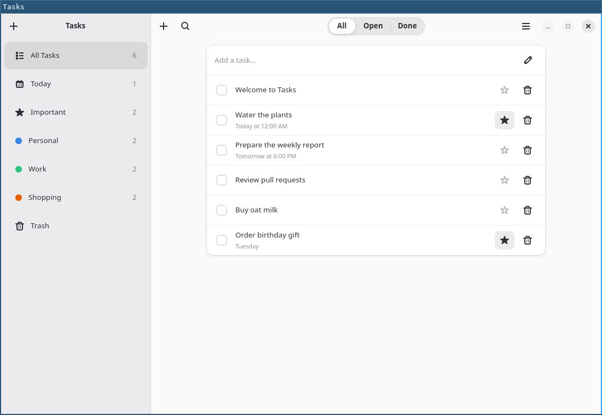
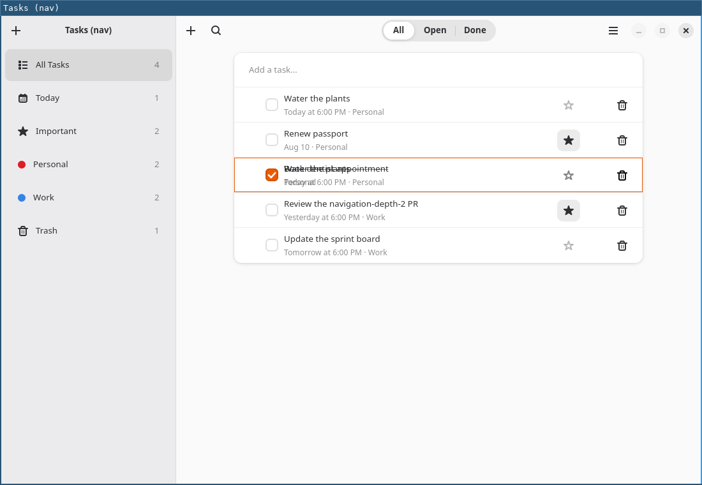

# Can an app written in portable React Native look native here?

`examples/tasks-nav` is this project's showcase for `createSidebarNavigator`,
and almost none of it is React Native. Its content screen is a `GtkBox` around
a `GtkScrolledWindow` around an `AdwClamp` around a `.boxed-list` `GtkListBox`
of `AdwActionRow`s. For a project whose pitch is "write the React Native API,
get real GTK widgets", that is the wrong thing to be showing.

It did not start that way. The screen was originally written in `ScrollView` /
`Pressable` / `Text` / `View` / `StyleSheet` (commit `3f96d80`) and looked
visibly worse than `examples/tasks-app` beside it, so it was rewritten to raw
Adwaita widgets and the `contentLayout: "widget"` screen option exists to
support that. The rewrite fixed the screenshot and hid the finding.

This is that finding, measured.

## The rig

Every image below is `examples/tasks-nav` at 1100x760 under its **own**
headless sway (pixman, one output, no input devices), captured with `grim`:
`scripts/shot-example-headless.ts`. That matters more than it sounds. The
alternative — `scripts/dev-loop.ts`, which screenshots the VM's real GNOME
session — can only capture whichever window happens to be focused, and several
sessions share this VM. Sequential runs of the headless rig are
byte-comparable, which is what let the last row of the table below be stated
as "identical" rather than "looks the same".

The task fixture is identical in every arm (the save file is removed before
each run, so the seed data is what renders).

## What the gap actually is

|                                                                                                                                                                       |                                             |
| --------------------------------------------------------------------------------------------------------------------------------------------------------------------- | ------------------------------------------- |
| **Adwaita widgets** — `.boxed-list` `GtkListBox` of `AdwActionRow`                                                                                                    |           |
| **Portable React Native, as an RN developer writes it** — this is commit `3f96d80`'s own tree: `ScrollView` + `Pressable` + `Text`, `StyleSheet` for padding and gaps |          |
| **The same tree, with `StyleSheet` asked for everything Adwaita's stylesheet asks for** — before any platform change                                                  |  |
| **The same styles, after this branch added `boxShadow`**                                                                                                              |   |

The middle two rows are the whole point. The distance between row 2 and row 3
is **styling the app never did**, not a platform limitation — and it is most of
the distance. The distance between row 3 and row 4 is a single missing style
prop.

## Where the numbers came from

Not from eyeballing a screenshot. libadwaita compiles its stylesheet into the
library, and it can be read back:

```
gresource extract /usr/lib/<triple>/libadwaita-1.so.0 \
  /org/gnome/Adwaita/styles/gtk.css
```

On libadwaita 1.9.1 / GTK 4.22.4, the rules that make a `.boxed-list` are:

```css
list.boxed-list,
list.content,
.card {
  background-color: var(--card-bg-color);
  color: var(--card-fg-color);
  border-radius: 12px;
  box-shadow:
    0 0 0 1px RGB(0 0 6/3%),
    0 1px 3px 1px RGB(0 0 6/7%),
    0 2px 6px 2px RGB(0 0 6/3%);
}
list.boxed-list > row {
  border-bottom: 1px solid var(--card-shade-color);
}
list.boxed-list > row:first-child {
  border-top-left-radius: 12px;
  border-top-right-radius: 12px;
}
list.boxed-list > row:last-child {
  border-bottom-left-radius: 12px;
  border-bottom-right-radius: 12px;
  border-bottom-width: 0;
}
list > row {
  padding: 2px;
}
row.activatable:hover {
  background-color: color-mix(in srgb, currentColor 4%, transparent);
}
row.activatable:active {
  background-color: color-mix(in srgb, currentColor 8%, transparent);
}
row:focus:focus-visible {
  outline-color: color-mix(in srgb, var(--accent-color) 50%, transparent);
  outline-width: 2px;
  outline-offset: -2px;
}
row > box.header {
  margin-left: 12px;
  margin-right: 12px;
  border-spacing: 6px;
  min-height: 50px;
}
row > box.header > box.title {
  margin-top: 6px;
  margin-bottom: 6px;
  border-spacing: 3px;
}
row label.subtitle {
  font-size: smaller;
  opacity: var(--dim-opacity);
}
```

Read against a column of pixels through the reference screenshot, that comes
out as: card top edge one pixel of `rgb(232,232,233)` then white; separators
`rgb(237,237,237)` — which is `--card-shade-color: rgba(24,24,24,0.08)` over
white, i.e. `255·0.92 + 24·0.08 = 236.4` — every **55 px**; and a four-pixel
gradient below the card, `222 → 233 → 238 → 243 → 246`, which is the two soft
drop shadows.

**A `.boxed-list` is, visually, a styled `View`.** There is no widget behaviour
in any of the above. That is why the answer to most of this is style, not
components.

## The gap list, and where each one closes

Three categories, in the order they were asked for: expressible in RN style
today; not expressible but should be (ours to fix); genuinely not a style.

### 1. Expressible in RN style today — the app simply never did it

| Gap                                                                                                                                                   | How                                                                                                                                                                                                                                                                                                                                                                                                                                                    |
| ----------------------------------------------------------------------------------------------------------------------------------------------------- | ------------------------------------------------------------------------------------------------------------------------------------------------------------------------------------------------------------------------------------------------------------------------------------------------------------------------------------------------------------------------------------------------------------------------------------------------------ |
| Card background                                                                                                                                       | `backgroundColor: PlatformColor("card-bg-color")`. Adwaita's variables are already reachable — this is what `PlatformColor` is for, and it tracks the light/dark switch for free.                                                                                                                                                                                                                                                                      |
| 12 px corner radius                                                                                                                                   | `borderRadius: 12`                                                                                                                                                                                                                                                                                                                                                                                                                                     |
| Hairline separators between rows                                                                                                                      | `borderBottomWidth: 1, borderBottomColor: PlatformColor("card-shade-color")`                                                                                                                                                                                                                                                                                                                                                                           |
| Rounded first/last row, no separator under the last                                                                                                   | Per-corner radii (`borderTopLeftRadius` …) keyed off the row index. RN has no `:first-child`, so the index is the app's (or a list component's) job — but nothing is missing from the style layer.                                                                                                                                                                                                                                                     |
| Row metrics: 50 px minimum, 12 px side inset, 6 px between prefix/title/suffix, 6 px above and below the title block, 3 px between title and subtitle | `minHeight`, `paddingHorizontal`, `gap`, `marginVertical` — a direct transcription of the CSS above                                                                                                                                                                                                                                                                                                                                                    |
| Dimmed subtitle                                                                                                                                       | `opacity: 0.55` (`--dim-opacity` is `55%`)                                                                                                                                                                                                                                                                                                                                                                                                             |
| **Row hover**                                                                                                                                         | `Pressable`'s `style={({ hovered }) => …}`. Already works, and works well: `tests/gtk/components/pressable-hover.gtk.test.tsx` asserts that a real `EventControllerMotion` `enter` swaps the widget's CSS class **without a React render at all** (the fast path in `components/pressable.tsx`). `hovered` is a documented platform extension to RN's state callback; `examples/hn-app`, the gallery and `examples/adwaita-primitives` already use it. |
| **Row press feedback**                                                                                                                                | Same callback's `pressed`.                                                                                                                                                                                                                                                                                                                                                                                                                             |
| Row activation on click                                                                                                                               | `Pressable`'s `onPress` — this is `AdwActionRow`'s `activatable` + `onActivated`.                                                                                                                                                                                                                                                                                                                                                                      |

One caveat that is real but small: Adwaita's hover tint is
`color-mix(in srgb, currentColor 4%, transparent)`, i.e. 4% of the _foreground_
colour, which follows the theme into dark mode. RN has no `color-mix` and no
`currentColor`, so an app writes two literal tints and picks between them with
`useColorScheme()`. That is how RN apps have always done this, on every
platform; it is not a gap in this layer, and adding a `color-mix` passthrough
to `parseColor` would be inventing non-RN surface to avoid three lines of app
code.

### 2. Not expressible, and that is ours — **fixed on this branch**

**`boxShadow`.** The `.boxed-list` frame is not a border. It is
`box-shadow: 0 0 0 1px …` plus two soft drops, and our style layer listed
`boxShadow` under "Ignored (outside the frozen contract)" — dropped with a
`console.warn`. That is one prop standing between an RN-written list and the
platform's own list, and it is a prop **React Native itself has had since
0.76**, with GTK4 CSS supporting `box-shadow` natively. Approximating it with
`borderWidth: 1` is not the same thing: a border consumes the box and insets
content, a shadow does not, and no border reproduces the two blurred drops.

Now implemented (`style/box-shadow.ts`), taking both RN forms. The string form
is **parsed, not forwarded** — a `PlatformColor` only becomes a GTK variable
after `parseColor` has seen it, and a malformed shadow should cost one dev
warning rather than poison the whole declaration block, exactly as an invalid
`backgroundColor` already does. Two RN behaviours are matched deliberately:
lengths follow RN's own grammar (a bare number or `px`, nothing else; blur may
not be negative), and **an omitted colour renders black, not `currentColor`** —
RN's documented deviation from CSS, which only stays true here because it is
emitted explicitly.

The result, sampled down the same pixel column as the reference:

|                                  | card top edge         | separator pitch | bottom shadow                 |
| -------------------------------- | --------------------- | --------------- | ----------------------------- |
| Adwaita `.boxed-list`            | `245 → 232 → 255`     | 55 px           | `222 → 233 → 238 → 243 → 246` |
| RN `View` + `StyleSheet`, before | `250 → 255` (nothing) | 53 px           | none                          |
| RN `View` + `StyleSheet`, after  | `245 → 232 → 255`     | 53 px           | present                       |

The card frame is **pixel-identical** to the widget's. The 53-vs-55 pitch is
`list > row { padding: 2px }` not yet transcribed into the example, not a
platform gap.

**`outlineWidth` / `outlineColor` / `outlineStyle` / `outlineOffset`.** Found
while looking for the focus ring. Adwaita draws every focus ring with CSS
`outline`, GTK4 implements it, and **React Native has had these four props
since 0.77** — we had none of them. Unlike `borderWidth`, an outline takes no
layout space, so it never has to reach Yoga: it is a pure visual prop. Added in
the same slice, because a focus ring that cannot be _drawn_ makes the
component-level work below pointless.

Both are in `style/README.md` now, and both are covered by
`tests/unit/style/box-shadow.test.ts`.

### 3. Genuinely not a style — needs a component

These are the ones where reaching for `StyleSheet` would be forcing it.

| Gap                                                                                                                                               | Why no style closes it                                                                                                                                                                                                               | Where it belongs                                                                                                                             |
| ------------------------------------------------------------------------------------------------------------------------------------------------- | ------------------------------------------------------------------------------------------------------------------------------------------------------------------------------------------------------------------------------------ | -------------------------------------------------------------------------------------------------------------------------------------------- |
| ~~**Keyboard navigation between rows**~~ **— closed**                                                                                             | `GtkListBox` implements this as a widget behaviour. RN's `View` is not focusable and RN has no focus-traversal model on the desktop at all.                                                                                          | Neither, in the end: `focusable` puts the widget in GTK's own focus chain, and GTK's directional keynav does the traversal — see below       |
| ~~**Focus state**~~ **— closed**                                                                                                                  | The _ring_ is now drawable (above), but nothing tells a `View` it is focused: `Pressable`'s state callback is `{pressed, hovered}` with no `focused`, and there is no `onFocus`/`onBlur` outside `TextInput`.                        | The portable components, not `common`: `focusable`/`onFocus`/`onBlur` and a `focused` state, all shapes RN already has elsewhere — see below |
| **`AdwEntryRow`'s inline editing** (the "Add a task…" row: a label that floats up into a title when the field has text, with an apply affordance) | This is a composed widget with its own state machine, not a look. RN has `TextInput` and a placeholder, which is a different interaction.                                                                                            | `react-native-gtkx/common`, or accept the difference                                                                                         |
| **Named theme icons** (`starred-symbolic`, `user-trash-symbolic`)                                                                                 | RN's `Image` takes a file path or a URI. An icon _name_ resolved against the desktop icon theme has no RN equivalent — RN apps bundle assets or use `react-native-vector-icons`.                                                     | `react-native-gtkx/common` — **now `Icon`**, the shape every RN app already uses                                                             |
| Strikethrough on a completed task                                                                                                                 | Found here, closed as a style after all: `textDecorationLine` is an RN prop we did not have, and GTK draws it through **Pango attributes** rather than CSS — the same path `textAlign` already takes. Added alongside the two above. | the style/component layer                                                                                                                    |

## What shipped, and what is left

The list chrome now lives in `react-native-gtkx/common` as `List`, `ListRow`,
`ListSeparator` and `rowPosition`, with `Icon` for named theme icons. Nothing
in them creates a widget an app could not have created itself — they are
`View`, `Pressable` and `Text` with the numbers above baked in — which is the
point: an app should not have to re-derive libadwaita's metrics, and it should
not have to re-derive them again when libadwaita moves.

`examples/adwaita-primitives` uses them, and its article list (which was a
hand-styled `Pressable` with a hover tint, and did not look like GNOME) is now
the real thing:



**Two things were left open here, and both are now closed** — keyboard
navigation with a focus ring on `ListRow`, and `examples/tasks-nav`'s own
rewrite. The second turned out to be blocked on something this document had
not named at all, and on a bug underneath that.

### Focus: RN already had the shape

Nothing was invented. `focusable` is on RN's own `View` (Android, Windows);
`onFocus`/`onBlur` are on `View` in react-native-web and
react-native-windows; and react-native-web's `Pressable` state callback is
`{focused, hovered, pressed}` — `hovered` was already a documented extension
here for exactly that reason, so `focused` is the same move. Enter and Space
activate a focused `Pressable`, as they do on web and Android, because
`focusable` without that is decorative.

The traversal half needed nothing of ours: `gtk_widget_set_focusable` puts
the widget into GTK's focus chain, and GTK's directional keynav then moves
between focusable siblings. The claim above that "RN has no focus-traversal
model on the desktop" was true and beside the point — GTK has one, and
`focusable` is the whole of the connection to it.

### The one that was not on the list: drag-reorder

Found by trying the rewrite rather than by reading the screen. `tasks-nav`'s
rows carried drag-and-drop through `GtkDragSource`/`GtkDropTarget` in an
`AdwActionRow`'s `controllers` slot (#33, #39), and **a `Pressable` exposes
no widget** — its `ref` is a `ViewHandle`, which is right and deliberate. So
there was no way to attach a GTK event controller to a row written in React
Native, and rewriting the rows would have silently dropped a shipped
feature. That, not the styling, was the actual blocker.

It is closed by `Controllers` from `react-native-gtkx/gtk` — the
`WindowControllers` idea one level down: declare in the app tree, attach to
the enclosing view's widget. A prop on `View` was rejected for being
invisible off Linux; the reasoning is in
[platform-layer.md](../platform-layer.md#controllers--a-gtk-event-controller-on-a-react-native-component).
`List`'s `onReorder` and `ListRow`'s `reorderId` package it, and are written
on top of it.

### And the bug underneath that

With the drag delivering correctly, the rows still did not move. A layout
child chose its Yoga index once, **on mount**, from where the reconciler had
put its widget — right for a child that appears mid-list, blind to one that
_moves_. React reorders keyed siblings by moving the existing fibers, so
nothing mounts and nothing unmounts: the widgets ended up in the new order
while the shadow tree kept the old one, and the rects come from the shadow
tree. Every list that can be sorted, filtered into a different order or
dragged into one was affected. Nothing had ever exercised it, because the
only reorderable list in the repo was a `GtkListBox` doing its own layout.
Fixed by re-syncing the shadow tree to widget order after each commit of a
container, and pinned by `tests/gtk/layout/child-order.gtk.test.tsx` — whose
assertions are about the RECTS, since the widget order was already right.

## The rewrite, and the proof

|                                                                                                                                                                                            |                                         |
| ------------------------------------------------------------------------------------------------------------------------------------------------------------------------------------------ | --------------------------------------- |
| **`examples/tasks-nav`, body rewritten in React Native** — `ScrollView`/`View`/`Text`/`TextInput` plus `common`'s `List`/`ListRow`                                                         |       |
| **`examples/tasks-app` beside it, unchanged** — the hand-built Adwaita comparison that makes the claim checkable                                                                           |   |
| **Mid-drag, driven by a real `zwlr_virtual_pointer_v1`**: GDK's own drag icon (a `Gtk.WidgetPaintable` of the row) under the cursor, and the accent drop-target ring on the row it is over |  |

The drag is also a test, not only a screenshot:
`tests/gtk/common/list-reorder.gtk.test.tsx` drives a real virtual pointer
through press-move-release over two `ListRow`s and asserts both the callback
ids and that the rows changed places.

What did not survive the rewrite, stated rather than glossed: `GtkSearchBar`'s
reveal animation (a widget behaviour; a `Widget` wrapper around it would need
re-measuring every animation frame) and `AdwEntryRow`'s floating label, which
is the composed-widget difference this document already named. The checkbox
and the two flat icon buttons inside a row are still real widgets in React
Native layout — RN has no checkbox at all, and a tooltip and an accessible
label are worth keeping.

## What this says about the showcase

The honest summary is that **the example was under-styled, and the platform was
missing one prop that mattered and three that will.** Not "React Native cannot
look native here".

That reframed the rewrite, and the rewrite has since happened:
`tasks-nav`'s body is `View` / `Text` / `Pressable` / `TextInput` /
`ScrollView` / `StyleSheet` plus `common`'s list-and-row pair, and it reaches
`examples/tasks-app`'s appearance rather than approaching it. `tasks-app`
stays exactly as it is — the hand-built Adwaita comparison is what makes the
claim checkable.

One correction to the original framing, worth making explicitly: the
platform was missing **one prop that mattered, three that would, and one
thing that was not a prop at all** — a door onto GTK behaviour from a React
Native component. The styling half of this document was right; it was not
the whole answer.

`contentLayout: "widget"` stays too. An app whose body really is a widget tree
is a legitimate thing to be, and `sidebarContent`/`sidebarRow` rest on the same
idea. What changes is which of the two the project's showcase demonstrates.

## Notes for whoever runs this again

- **Pointer input on the headless rig CAN be screenshotted — this document
  used to say it could not, and that was wrong in an instructive way.** The
  diagnosis was right: a wlroots seat started with
  `WLR_LIBINPUT_NO_DEVICES=1` has no pointer capability at all
  (`swaymsg -t get_seats` → `capabilities: 0, devices: []`), so no
  `wl_pointer` is advertised; sway's `seat - cursor set X Y` answers
  `success: true` and changes nothing; and `wlrctl`'s `wlr-virtual-pointer`
  creates and destroys its device per invocation, so the capability appears
  and disappears faster than a frame. The conclusion drawn from it — that no
  pointer is possible here — did not follow. **Hold the connection open.** A
  process that binds `zwlr_virtual_pointer_manager_v1` itself, creates one
  device and keeps it for the whole session gets a seat with a real pointer
  capability for as long as it lives; `wlrctl`'s problem was its lifetime,
  not the protocol. `tests/gtk/support/virtual-pointer.ts` is ~300 lines of
  hand-rolled Wayland that does exactly this, and the mid-drag screenshot
  above was taken with it against a running `gtkx dev`.
  `tests/gtk/components/pressable-hover.gtk.test.tsx` still drives the
  `EventControllerMotion` signal directly, which is cheaper and remains the
  right tool for the hover fast path.
- The examples persist to `~/.local/share/dev.rngtkx.tasks{,nav}/tasks.json`.
  Remove it before a comparison run or you are shooting the previous run's
  state.
