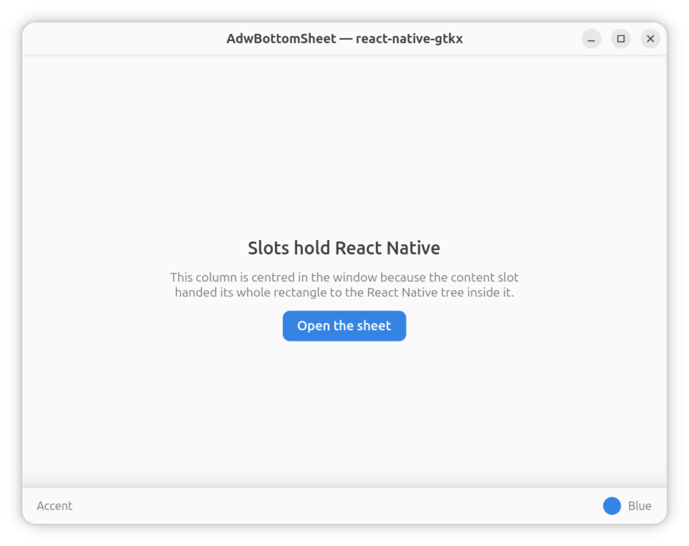
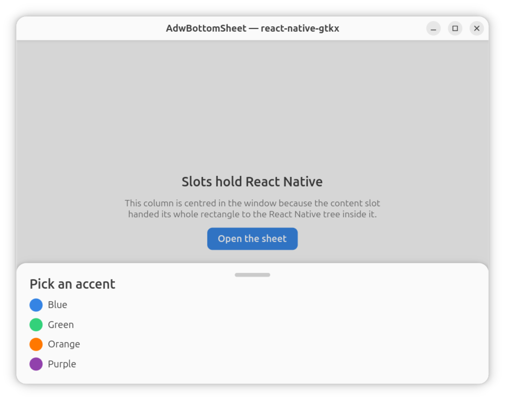
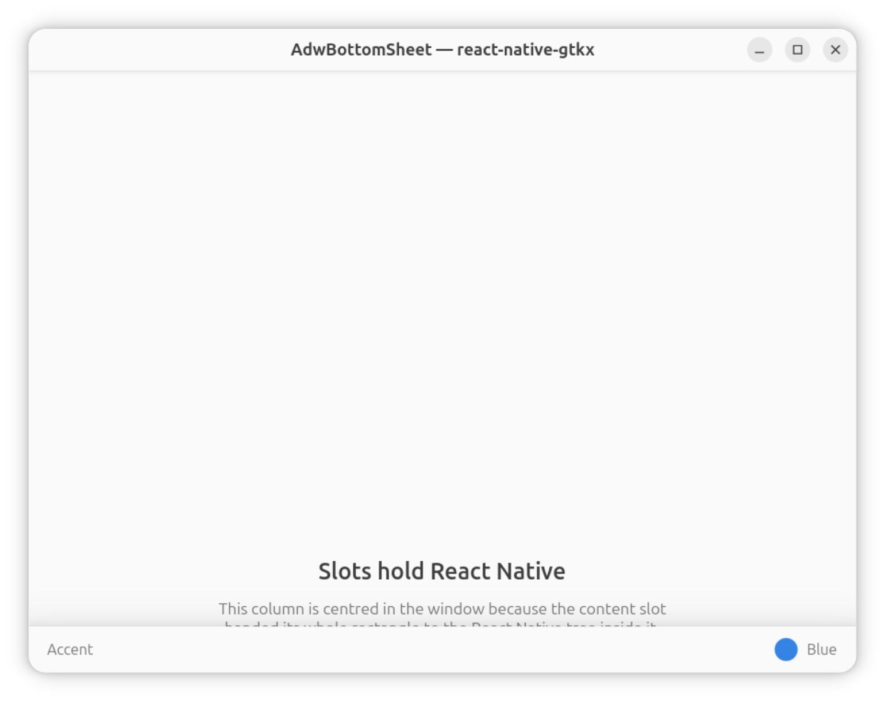

# bottom-sheet — React Native inside GTK widget slots

An ordinary React Native app whose entire UI is one Adwaita widget:
`AdwBottomSheet`, with all three of its slots filled with plain
`<View>`/`<Text>`/`<Pressable>`.

| Closed                                                                                                                                                            | Open                                                                                                                               |
| ----------------------------------------------------------------------------------------------------------------------------------------------------------------- | ---------------------------------------------------------------------------------------------------------------------------------- |
|  |  |

```bash
npm install
npm run build -w bottom-sheet-example
npm run start -w bottom-sheet-example
```

## What a slot is

A **slot** is a widget property that takes a widget:

```tsx
<AdwBottomSheet content={…} sheet={…} bottomBar={…} />
```

not a child. gtkx routes an element-valued prop into the property it names,
which moves the rendered widget in the GTK tree — and only in the GTK tree.
In the React tree the element stays exactly where you wrote it.

That matters, because React Native layout follows the REACT tree. Without a
boundary, the `<View>` above would put its Yoga node into the enclosing
window root and lay itself out against the window's viewport, while GTK hands
it the slot's rectangle. So a slot clears the layout root: GTK widgets in a
slot render bare (which is what they want), and React Native content brings
its own root.

## The two roots, and why you pick

```tsx
import { IntrinsicContent, SlotContent } from "react-native-gtkx/common"
```

| Slot        | Wants                  | Wrapper            |
| ----------- | ---------------------- | ------------------ |
| `content`   | fill the widget's area | `SlotContent`      |
| `sheet`     | rise to its own height | `IntrinsicContent` |
| `bottomBar` | hug the row it holds   | `IntrinsicContent` |

One widget, both answers — which is exactly why the platform does not guess
for you. All three are plain `GtkWidget` properties; nothing in the name, the
type or the introspection data says which one fills. That lives in the
widget's own layout code, and here it disagrees with itself two ways out of
three.

Try swapping them, it is instructive:

- `SlotContent` in `sheet` or `bottomBar` → the panel collapses to a sliver
  and the bar disappears. A filling root reports a zero minimum (so a window
  can always shrink), and a size-to-content slot asking "how big are you?" is
  told "nothing".
- `IntrinsicContent` in `content` → the column stops being centred. An
  intrinsic root's viewport is its own content size, so `flex: 1` has nothing
  to fill and `justifyContent: "center"` has no spare room to centre in.

Forget the wrapper entirely and you get an error naming the widget and the
slot, with both options spelled out. It used to render instead — content in a
slot with no root joined the enclosing window's Yoga tree, was laid out
against the window's viewport and drawn in the slot's rectangle, and looked
like this:



## The two sizes

They are independent, and both are in `src/App.tsx`:

```tsx
<AdwBottomSheet
  style={{ flex: 1 }} // ① the WIDGET in React Native layout
  content={
    <SlotContent>
      <View style={{ flex: 1 }} /> // ② the CONTENT inside the slot
    </SlotContent>
  }
/>
```

① A wrapped GTK widget is a Yoga **leaf** taking its natural size until the
style says otherwise. `flex: 1` is what makes the sheet fill the window
instead of hugging itself — the same rule as any other React Native child.

② Inside the slot, a fresh Yoga root whose viewport is the rectangle the
widget hands out. `flex: 1` there fills the SLOT, never the window — every
root has its own viewport, and the two numbers never meet.

## Why the default chrome

`AppRegistry.runApplication` is called without `chrome: "content"`, so the
window brings its own titlebar and a window-level layout root. That root is
the point: it is the enclosing Yoga tree the slot content must NOT join. Apps
built entirely from Adwaita chrome (`examples/adwaita-primitives`,
`examples/tasks-nav`) use `chrome: "content"` and have no ambient root at
all — for them every page body is already a `SlotContent`.
