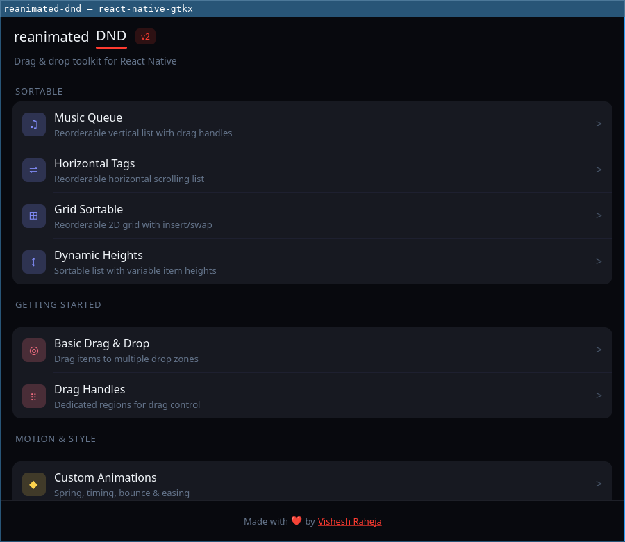
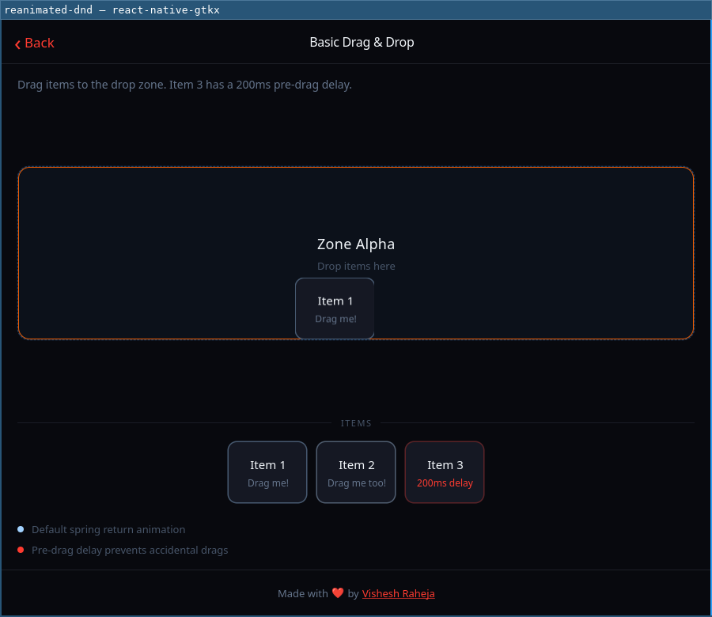
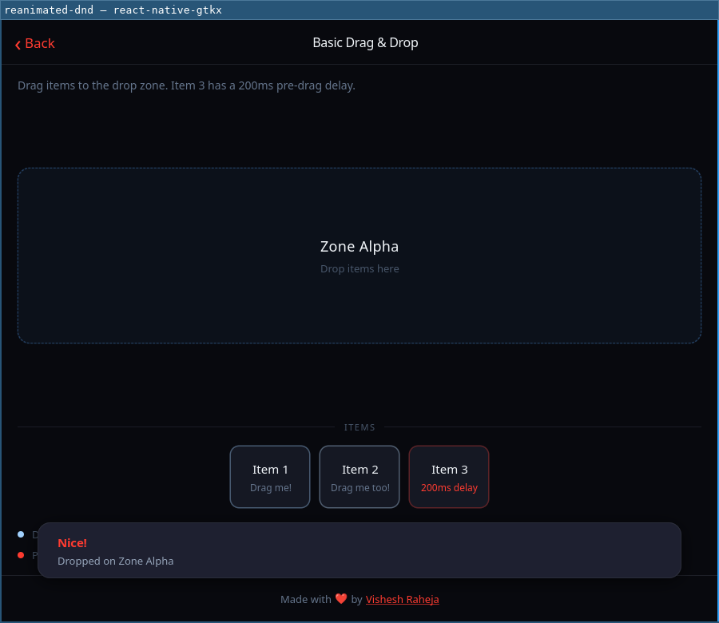

# reanimated-dnd — upstream's own example app, ported

[`react-native-reanimated-dnd`](https://github.com/entropyconquers/react-native-reanimated-dnd)'s
example app (v2.0.0, MIT), running on GTK4 through
[`react-native-gtkx/dnd`](../../docs/api.md#drag-and-drop-react-native-gtkxdnd).

Twenty screens, ~9,000 lines, written by someone who had never heard of this
platform. That is the point: `docs/research/drag-and-drop.md` claims that an
app already using that library **changes nothing in its source**, because
both bundler presets alias `react-native-reanimated-dnd` →
`react-native-gtkx/dnd` and `react-native-gesture-handler` →
`react-native-gtkx/gesture-handler`. Taking upstream's own app and running it
here is the strongest available test of that claim, and the honest way to
find where it is false.

**It is mostly true, and the exceptions are listed below in full.** Every
drag-and-drop call in this app is upstream's, unedited. Nothing that had to
change was a drag-and-drop call.

```sh
npm install                            # from the repo root (workspaces)
cd examples/reanimated-dnd
npm run dev                            # gtkx dev — vite + Fast Refresh
npm run build && npm start             # release bundle
```

## Two builds, one source

The same `src/` is built against BOTH drag-and-drop implementations, selected
by `DND_IMPL` — there is no second copy of the app, because a second copy
diverges and then proves nothing.

```sh
npm run dev                            # the MIRROR: react-native-gtkx/dnd
DND_IMPL=real npm run dev              # the REAL react-native-reanimated-dnd@2.0.0
```

`vite.config.ts` turns the preset's alias off for that one package
(`aliases: { "react-native-reanimated-dnd": false }`) and `gtkx.config.ts`
gives the second build its own application id, so the two can run side by
side as two windows. Everything the real library imports still goes through
the preset onto this platform's compat surfaces.

**Eighteen of the nineteen screens are pixel-identical at rest, and every drop
lands the same way on both.** The screen-by-screen table, the five inert props
photographed, and the one screen that fails (`Custom Draggable` — the port's
own `useDraggable` adaptation, not the library's) are in
[research/dnd-differential.md](../../docs/research/dnd-differential.md).

```sh
npm run build:mirror && npm run build:real     # dist-mirror/ and dist-real/
```



## The drag, driven by a real pointer

Not a callback assertion. `scripts/shot-example-drag.ts` binds
`zwlr_virtual_pointer_v1` on a private headless compositor and keeps the
device for the session, so GTK sees a real seat and the whole
compositor → GDK → `GtkDragSource` path runs. A Wayland pointer is addressed
by position, not focus, so the coordinates are the whole input.

| Mid-drag                                                                                                                                                                                    | Dropped                                                                                                                                   |
| ------------------------------------------------------------------------------------------------------------------------------------------------------------------------------------------- | ----------------------------------------------------------------------------------------------------------------------------------------- |
|  |  |

The mid-drag frame is the whole argument for building on GDK rather than on
JS. **The card over Zone Alpha is not the card being moved — the original is
still in its row below.** That floating copy is a `Gtk.WidgetPaintable` of
the view, carried by the compositor at the point it was grabbed, above every
window; it is what buys the theme's own cursors, hit testing against widgets
React Native never created, and drops from other applications. It is also
exactly why `dragAxis`, `dragBoundsRef` and `animationFunction` are accepted
and ignored: they describe where the view goes, and the view never went.

The toast is the second half of the proof, and of a different thing: it is
upstream's toast, rewritten off Reanimated onto `Animated` + `PanResponder`
(see `src/components/toast/toast.tsx`).

**The negative control.** On the Dropped Items Map screen, dragging Alpha
onto Zone 1 leaves the TRACKING readout with exactly one entry —
`map-item-1 is dropped on drop-zone-1`. `drop-zone-2` is absent: the zone the
pointer never crossed recorded nothing.

## Licence and attribution

The source under `src/` is derived from
[`react-native-reanimated-dnd`](https://github.com/entropyconquers/react-native-reanimated-dnd)'s
`example-app/`, © 2025 Vishesh Raheja, MIT — see [LICENSE](./LICENSE), which
is upstream's licence text carried verbatim.

What was **copied**: `theme.ts`, `navigation/AppNavigator.tsx`,
`components/ExampleHeader.tsx`, `components/Footer.tsx`,
`components/ExamplesNavigationPage.tsx`, `components/SortableExample.tsx`,
`components/BottomSheetOption.tsx`, `components/toast/{context,hooks,toast-provider}.ts(x)`
and all fifteen screens under `components/examples/`. Prettier reformatted
them to this repo's style (no semicolons, sorted imports); the edits beyond
that are enumerated below, and each carries a comment at the site.

What was **written for this port**: `src/index.tsx` (there is no Expo, so the
entry is `AppRegistry`), `components/NotImplementedNotice.tsx`, and rewrites
of `components/toast/toast.tsx`, `components/BottomSheet.tsx`,
`components/CustomDraggable.tsx`, `components/HorizontalSortableExample.tsx`
and `components/GridSortableExample.tsx` — all five because they are built on
Reanimated or on a sortable surface this platform does not implement. Each
file says so in its header.

Upstream's `assets/` (icons, fonts, wallpaper) are not copied.
`components/BasicDraggable.tsx` and `components/SortableHookExample.tsx` are
not copied either: nothing in upstream's app imports them.

## Every line the port had to change

Grouped by what the change proves. **None of them is a drag-and-drop call.**

### 1. Gaps this port closed in the platform

Fixed in `react-native-gtkx` rather than worked around here, because each one
made "your source still works" false:

| Found                                                                    | Fix                                                                                                                                               |
| ------------------------------------------------------------------------ | ------------------------------------------------------------------------------------------------------------------------------------------------- |
| `ScrollView`'s content container defaulted to `alignItems: "flex-start"` | Now `"stretch"`, as RN's is. This alone broke **seventeen screens**, each rendering as a narrow column against the left edge.                     |
| `Platform.OS` was typed as the literal `"linux"`                         | Now the full `PlatformOSType` union. `Platform.OS === "android" ? 8 : 6` is ordinary shared-source RN and was a **compile error** on eight lines. |
| No `ViewStyle`/`TextStyle`/`ImageStyle` exports                          | Added as aliases of the one flat style bag. `StyleProp<ViewStyle>` is how RN code types a style prop; there was no name to import.                |
| `SortableItemProps` had no `containerHeight`                             | Added, accepted and ignored (there is no autoscroll for it to feed). Upstream's own example passes it on every `SortableItem`.                    |
| `useDraggable`'s real return type was not exported                       | `UseDraggableResult` is exported now. The hook exists for components that render their own view, and they could not name what it hands back.      |
| `PressableStateCallbackType` augmentation lacked `focused`               | Added next to `hovered`. Found separately, by moving `tasks-nav`'s boxed list into the app.                                                       |
| Nested `<Text>` rendered as `[object Object]`                            | `Text` recurses into element children now. Documented behaviour, never tested; found **on screen**. See below.                                    |

### 2. Divergences, with the reason

Recorded rather than fixed, each because the platform genuinely differs:

| Upstream                                                         | Here                                                                                                                                                                                                                                                                                                                                                                                                                                                                              |
| ---------------------------------------------------------------- | --------------------------------------------------------------------------------------------------------------------------------------------------------------------------------------------------------------------------------------------------------------------------------------------------------------------------------------------------------------------------------------------------------------------------------------------------------------------------------- |
| `registerRootComponent` from `expo`                              | `AppRegistry.registerComponent` + `runApplication` — plus a window size, which a phone does not need. No Expo here.                                                                                                                                                                                                                                                                                                                                                               |
| `expo-font` + five `@expo-google-fonts/*` families               | Dropped. The `fontFamily` strings stay in every `StyleSheet` untouched and fall back to the theme font, so the styles are byte-identical to upstream's.                                                                                                                                                                                                                                                                                                                           |
| `expo-splash-screen`, `AnimatedSplashScreen`                     | Dropped. A desktop window has no splash screen, and that component is Reanimated + `expo-blur`.                                                                                                                                                                                                                                                                                                                                                                                   |
| `LogBox.ignoreLogs`                                              | Dropped. No redbox to suppress a warning in.                                                                                                                                                                                                                                                                                                                                                                                                                                      |
| `SafeAreaView` from `react-native-safe-area-context`             | `react-native`'s own. Its `edges={[…]}` prop is safe-area-context's, not RN's, and goes (4 sites).                                                                                                                                                                                                                                                                                                                                                                                |
| `createStackNavigator` from `@react-navigation/stack`            | From `react-native-gtkx/navigation`. That package cannot run here either (RNGH + Reanimated at module scope) and this platform ships its own stack over `Adw.NavigationView` with the same router, so `NavigationContainer` and `navigation.*` are unchanged. **Not aliased by the presets**: its surface is far wider than the four names implemented, and aliasing would turn `TransitionPresets`, `CardStyleInterpolators` and the header components into silent `undefined`s. |
| `cardStyle`, `gestureDirection` in `screenOptions`               | Dropped. GTK has one transition and one direction.                                                                                                                                                                                                                                                                                                                                                                                                                                |
| `react-native-reanimated` (toast, BottomSheet, AnimationExample) | Rewritten on `Animated` + `PanResponder`. This is the documented gap: the alias replaces the DnD library, not Reanimated. Each file's header maps the translation line for line.                                                                                                                                                                                                                                                                                                  |
| `Gesture.Pan()` / `GestureDetector` (toast, CustomDraggable)     | `PanResponder.create` + spread `panHandlers`, and for `CustomDraggable` the drag source as a child rather than a wrapper — because on this platform a drag is a property of the widget, not of a recogniser wrapped around it.                                                                                                                                                                                                                                                    |
| `@react-native-community/slider` (AlignmentOffsetExample)        | A row of preset buttons in plain RN. Not installed, no counterpart; reaching for `GtkScale` would stop this being ordinary React Native.                                                                                                                                                                                                                                                                                                                                          |
| `expo-blur`, `ImageBackground`, `event.stopPropagation()`        | GridSortableExample only, which is not implemented anyway (below).                                                                                                                                                                                                                                                                                                                                                                                                                |
| `scrollEventThrottle`, `showsVerticalScrollIndicator`            | Dropped (16 sites). Not `ScrollView` props here.                                                                                                                                                                                                                                                                                                                                                                                                                                  |
| `textAlignVertical`, `textTransform`                             | Dropped. Android-only and absent from the style contract respectively; the uppercase is done at the call site instead.                                                                                                                                                                                                                                                                                                                                                            |
| `hitSlop` on a `TouchableOpacity`                                | Dropped. Not implemented.                                                                                                                                                                                                                                                                                                                                                                                                                                                         |
| `pointerEvents` on `Animated.View` (BottomSheet)                 | Moved to a plain `View` around it. RN's `Animated.View` takes every `View` prop; this platform's takes the responder props, `style`, `onLayout` and `testID`. **A gap, not a divergence** — recorded, not yet fixed.                                                                                                                                                                                                                                                              |
| `useRef<View>` / `React.RefObject<View>` for `dragBoundsRef`     | `ViewHandle`. RN's `View` is a class and so usable as a type; here it is a function component.                                                                                                                                                                                                                                                                                                                                                                                    |
| **`<Widget>` around `<AppNavigator />`** — one line ADDED        | The single biggest finding. See below.                                                                                                                                                                                                                                                                                                                                                                                                                                            |

### 3. The one line added, and why it is a gap

```tsx
<Widget style={{ flex: 1 }}>
  <AppNavigator />
</Widget>
```

This platform's stack navigator renders an `Adw.NavigationView` — a real GTK
widget — and a GTK widget nested inside React Native layout needs a box to
live in. Without it the navigator is allocated nothing, **the window is
blank**, and the only diagnostic is
`Trying to snapshot AdwNavigationView without a current allocation` on stderr.

It does not bite `examples/hn-app` because that puts `<Stack.Navigator>` at
the very root of the app tree, where GTK allocates it directly. Upstream's
`App.tsx` does not — and neither does upstream's own documented quick start,
which wraps everything in `<GestureHandlerRootView>`. So **any** app that
follows the reanimated-dnd shape and uses a stack navigator hits this, and it
is the one place where the "changes nothing in its source" claim is currently
false in a way that is not about Reanimated. `createStackNavigator` should
bring its own box; recorded as a follow-up.

### 4. Upstream bugs this port surfaced

- `components/SortableExample.tsx` declares `fontFamily: "Syne_700Bold"`
  **twice** in the same `modalTitle` rule. Harmless upstream (the values are
  equal); an error here, because the example is typechecked.
- `handleLayoutUpdateComplete` (DroppedItemsMapExample), `getStateStyle`
  (DragStateExample) and `selectedDurationLabel` (AnimationExample) are
  defined and never used upstream.
- `components/toast/toast-provider.tsx` caches rendered nodes in a ref and
  both reads and writes that ref during render. React reconciles keyed
  children already, so the cache does nothing except make the render impure;
  dropped.
- Several array indexings assume a value that `noUncheckedIndexedAccess`
  (this repo's tsconfig, not upstream's) will not grant. Marked with `!`
  rather than restructured.

## The bug the port found on screen, not in a typechecker

The Dropped Items Map screen rendered
**`[object Object] is dropped on [object Object]`**.

Its markup is `<Text>{id} is dropped on <Text>{zone}</Text></Text>` — a
nested `Text`, which is how React Native marks up a run inside a paragraph.
This platform's `Text` flattened its children with `String(child)`, so a
nested element became `[object Object]`. `docs/api.md` had always claimed
nested `Text` elements were "concatenated without per-span styles": the
second half was true, the first was not, and nothing tested it.

Fixed in `components/text.tsx` (recurse into elements), with
`tests/gtk/components/text-nested.gtk.test.tsx` covering it — plus `true`,
which used to render as the word "true" because only `false` was dropped.

It is the clearest argument for this example existing. Every static check in
the repo was green, and the screen said `[object Object]`.

## The two screens that are not implemented

Kept as routes, with the omission stated **in the app** rather than only in
the docs — a menu that lists a screen which silently does nothing is worse
than one that says what is missing. `components/NotImplementedNotice.tsx` is
the banner; the module behind them is equally loud (importing `SortableGrid`
fails at build time, and `SortableDirection.Horizontal` throws rather than
laying out vertically).

- **Horizontal Tags** — `SortableDirection.Horizontal`, plus the whole
  horizontal prop surface (`itemWidth`, `gap`, `leftBound`,
  `autoScrollHorizontalDirection`, `onDraggingHorizontal`). Upstream's tag
  data is still rendered, in the same strip, without the drag.
- **Grid Sortable** — `SortableGrid`, `SortableGridItem`, `GridOrientation`,
  `GridStrategy`. Same eleven apps in the same grid, without the drag.

Both are deferred rather than impossible: nothing their mechanism needs
differs from the vertical list. See
[research/drag-and-drop.md](../../docs/research/drag-and-drop.md).

## Where this sits next to `examples/gallery`

It does not supersede the gallery's drag-and-drop section, and the two are
not redundant — they answer different questions.

The gallery section is **ours**: three tight demos written to show what this
platform's implementation does, including the things it does better than
upstream (a real drag icon, the theme's cursors, a `capacity`-full zone
showing the no-drop cursor). It stays where it is, and it is what the
component-by-component screenshots are taken from.

This example is **theirs**: 9,000 lines nobody here wrote, exercising props
we would not have thought to exercise, in combinations we would not have
picked. It is a test of the claim, not a demonstration of the feature — and
the six platform gaps in §1 are what it was worth.

## It reads as ordinary React Native

That is the point of the module, and the way to check it is to open any
screen under `src/components/examples/` and look for the platform:

```tsx
import { GestureHandlerRootView } from "react-native-gesture-handler"
import { Draggable, Droppable, DropProvider } from "react-native-reanimated-dnd"
```

Neither package is installed in this workspace. Neither ever resolves. Both
lines are upstream's, unedited, and the presets are what make them build.
