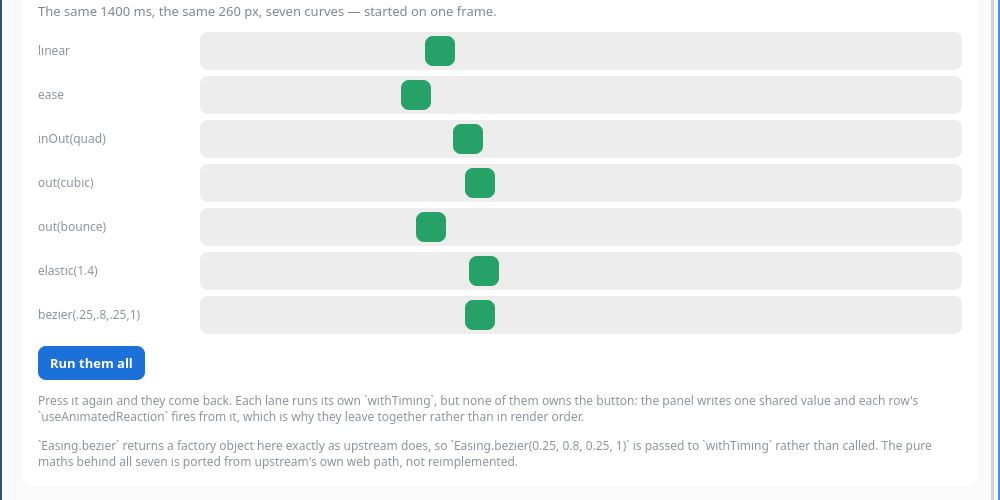

# reanimated-playground — the Reanimated surface, hands on

Seven panels on one scrolling screen, each one a thing
[`react-native-gtkx/reanimated`](../../docs/api.md#react-native-reanimated-react-native-gtkxreanimated)
either does or deliberately does not do. It is meant to be **run and poked
at**, not read: drag the box, press the buttons, watch the render counter not
move — and in panel 07, watch two boxes on the same shared value disagree
about whether they are allowed to animate.

```sh
npm install                            # from the repo root (workspaces)
cd examples/reanimated-playground
npm run dev                            # gtkx dev — vite + Fast Refresh
npm run build && npm start             # release bundle
```


Every import in `src/` is a **bare package name** — `react-native` and
`react-native-reanimated`. Neither package is installed in this workspace and
neither ever resolves; both bundler presets alias them, so the app is ordinary
React Native source that happens to render GTK widgets. There is no
`react-native-gtkx/...` import anywhere in the example, which is the point:
if one were needed, it would be a gap in the surface rather than a detail of
the demo.

## What each panel is for

**01 Drag me.** A shared value per axis, written from `PanResponder`'s gesture
state, read back through `useAnimatedStyle` into `transform`, sprung home with
`withSpring` on release. **It is not `GestureDetector`**, deliberately: this
panel is the React Native responder system, the API an RN app used before the
Gesture API existed, running here unchanged. `Gesture.Pan()`, `Tap`,
`LongPress` and `GestureDetector` are implemented now — see
`examples/gesture-detector`, which is where they are demonstrated — so the two
examples cover the two layers rather than duplicating one. The Reanimated half
here is exactly what you would write on iOS.

The arena sets `overflow: "hidden"`, so throwing the box past an edge cuts it
off at the arena — rounded corners included — instead of letting it slide over
the caption underneath. That is the platform honouring the style, which it did
not do until recently: `overflow` reached Yoga and stopped there, so a container
that asked to clip was accepted and clipped nothing. The other way to keep a
dragged box in its arena is to `clamp()` the shared value inside the gesture,
and this panel deliberately does not: clamping is an app deciding where a drag
ends, and it would leave nothing for the clip to demonstrate.

**02 Zero renders per frame.** The strongest claim this surface makes, in the
form a person can check. A box has been animating since the app opened; next
to it, the number of times React rendered it. It reaches 1 at mount and stays
there while the frame counter climbs at ~60 a second. Drag the panel-01 box
and its counter behaves the same way: several hundred frames, one render.

**03 Colours.** `interpolateColor` into `backgroundColor`, driven by a slider
you drag and by five preset stops — plus an auto pair on `withRepeat` showing
`'RGB'` and `'HSV'` on the same value at the same instant, which is the
clearest way to see that the two colour spaces are both really implemented.

**04 The five animation functions.** `withTiming`, `withSpring`,
`withSequence`, `withRepeat`, `withDelay` and `cancelAnimation` on one box, so
they can be fired back to back and compared.

**05 Easing.** Seven curves over the same 1400 ms and the same 260 px, all
started from one press — one shared value the rows react to, rather than seven
buttons.



**06 One value, three consumers.** Two `useDerivedValue`s and one
`useAnimatedReaction` off a single shared value, driving three widgets and a
tally. No hook is given a dependency array and everything still updates,
because tracking here is dynamic — recorded from the reads a mapper actually
performs.

**07 Where the boundary is.** The panel this example exists for as much as the
counter does — and it is a boundary now rather than a wall, which is the whole
reason it was rewritten.

![Panel 07 after pressing "Animate width", "Animate height" and "Force a React render": the green box in the first lane 280 px wide with a "1" in it, the red box in the centred lane the same 280 px but only because the render was forced, the red box in the third lane grown to 76 px tall with the purple strip pushed down below it, two yellow warnings quoting in full the cross-axis-alignment refusal and the MAIN-axis one, and a table reading 7.1 µs for a driven size and 21.7 µs with wrapped text against 71 / 129 / 509 µs for a refused one at 5, 60 and 300 children.](../../docs/shots/reanimated-playground-refused.png)

The first two lanes animate **the same shared value**, with the same box, and
differ by one style on the lane that contains them. The first lane is an
ordinary column, so `width` is its cross axis: the box grows from its leading
edge, no sibling moves, and it runs at frame rate — 7.1 µs a frame, the same
at five siblings or three hundred, with the render counter inside the box
sitting still while it moves. The second lane says `alignItems: "center"`, so
a wider box would also be a box in a different place, and that is refused.

Press "Animate width" and the two disagree in front of you. The refusal is
printed in the app (`src/warnings.ts` wraps `console.warn`; the panel renders
the buffer), naming the style that stopped it. "Animate height" adds the other
kind: `height` is the column's main axis, so growing the box would push the
strip below it down, and the warning says so and quotes what that costs — a
Yoga pass plus its commit walk is 71 µs on a five-child container, 129 µs at
sixty and 509 µs at three hundred, against 7.1 µs for the driven path at all
three. A refused layout write is O(the container); the driven one is O(the
node).

Then press "Force a React render" and both refused boxes jump to where their
animations ended — the documented behaviour, that a refused value is applied
on the next React render rather than dropped. `borderRadius` gets the other
message (not a layout property, still not driveable) and lands on the same
render. `scaleX`, the transform the refusals name, runs at frame rate next to
them — and is an approximation rather than a replacement, which the driven
lane above it demonstrates by re-laying-out what is inside the box instead of
stretching it.

## Three things this example found

**1. The React Compiler is on, and it froze the render counter.** `gtkx dev`
and `gtkx build` run `@gtkx/cli`'s React Compiler vite plugin. A component
that reads a mutable module object during render therefore has that read
memoised — `readCounter("loop")` takes no reactive input, so it is computed
once and the JSX built from it is reused forever. The readout re-rendered
fourteen times and displayed the mount value every time, which looked exactly
like a broken counter and was not. `src/stats.ts` snapshots the counters into
state on a timer instead, so the JSX has something that changes. Worth knowing
for any gtkx app that polls a mutable value: **it will not repaint**.

The same thing bites panel 07 in a subtler way. An `Animated.View` whose props
are all stable is memoised, so a parent's `setState` does not re-render it and
"applied on the next React render" is not demonstrable. The forced-render
count is printed inside the boxes so that the next render actually reaches
them — which in the driven lane doubles as the proof that the animation costs
no renders at all.

**2. `sharedValue.value = …` inside a component does not lint.** This repo's
`eslint-plugin-react-hooks` v7 (`react-hooks/immutability`) rejects
"modifying a value returned from a hook", which is every `x.value = withSpring(0)`
in a handler or an effect. The app therefore uses `x.get()` / `x.set(...)`
throughout — the accessor pair upstream added for exactly this reason, and
which this surface implements. Both spellings work at runtime; only one
passes the gate.

**3. `react-hooks/refs` has no spelling for a render counter.** Counting
renders means writing a ref during render, which is precisely what the rule
forbids. `eslint.config.ts` turns that one rule off for this directory, next
to the two exemptions the repo already carries for `src/components` (lazy ref
init) and `spike/`.

## What is not here

Nothing in the app is faked, and a few things a reader might expect are absent
— none of them because the demo is hiding something:

- **`GestureDetector` / `Gesture.Pan()`** — implemented, but demonstrated in
  `examples/gesture-detector` rather than here. Panel 01 deliberately uses
  `PanResponder`, so the two examples cover the two gesture layers instead of
  duplicating one.
- **Layout animations** (`FadeIn`, `LinearTransition`, `Keyframe`) —
  implemented, and not yet demonstrated here. Worth a panel.
- **`Animated.FlatList`** — throws rather than warns, so there is no running
  demo to show. Panel 07 names it; `docs/api.md` has the reasoning.
- **The other four ways a size lands on the refused side** — a container sized
  by its children, a node whose other axis comes from its content, an
  `aspectRatio` or a `min`/`max` clamp, and a wrapping container. Panel 07
  demonstrates two of the six (a centred container and a main-axis size) and
  names the rest in its captions; six lanes that all do nothing would teach
  less than two that disagree.

An animated `width` **is** demonstrated as working, in panel 07's first lane.
It used to be in this list, and this README used to say that pressing "Animate
width" does nothing and that an animated `width` could resize the window it is
in. Both were true when they were written and neither is now
([docs/research/animated-size.md](../../docs/research/animated-size.md)).

`useAnimatedProps` is not demonstrated either: its real consumer is the SVG
shapes, and that case is already covered by the gallery's SVG section.

## How the screenshots were taken

`scripts/shot-example-headless.ts` and `scripts/shot-example-drag.ts`, on a
private headless compositor with a `zwlr_virtual_pointer_v1` device — so the
drag above is a real pointer through the real compositor → GDK → responder
path, not a synthesised callback.
