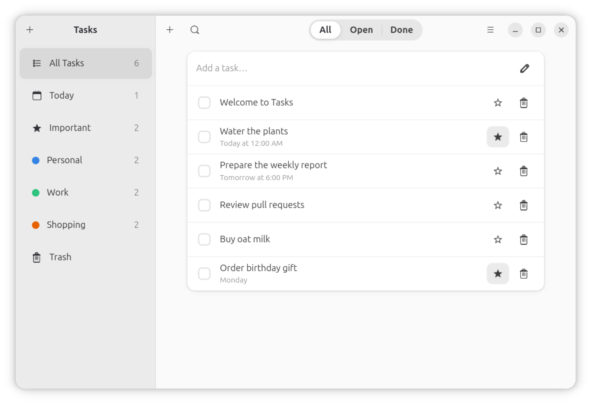
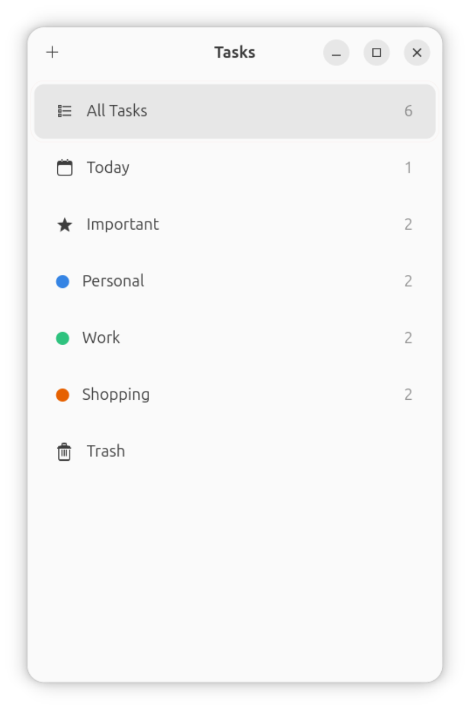

# tasks-app — the GTKX tutorial's Tasks app, ported to React Native

A port of **Tasks**, the GNOME task manager built across the
[gtkx tutorial](https://gtkx.dev/tutorial/) (source:
[`gtkx-org/gtkx`, `examples/tutorial`](https://github.com/gtkx-org/gtkx/tree/main/examples/tutorial)).
This is a port, not a copy: the same application and the same store logic,
written against the React Native API and [react-native-gtkx](../../README.md)
instead of raw gtkx. It is the most demanding thing built on this platform
so far, and that was the point of building it — see
[What this could not do](#what-this-could-not-do) below for the parts of
the platform it found unfinished.

|  |  |
| :--------------------------------------------------------------------------------------------------------------------------------------------------------------: | :------------------------------------------------------------------------------------------------------------------------: |
|                                                                               wide                                                                               |                                       collapsed below the `Adw.Breakpoint` threshold                                       |

## Run it

```sh
npm install          # from the repo root (workspaces)
cd examples/tasks-app
npm run dev           # gtkx dev — vite + Fast Refresh
npm run build && npm start   # release bundle
```

Needs GTK4 ≥ 4.20, libadwaita ≥ 1.8, Node ≥ 24. Uses the `gtkx dev`/`gtkx build`
toolchain (like `examples/gallery`), not Metro — the `#data/*.gschema.xml`
import the settings hooks rely on only resolves for free on that path (the
`gtkx:settings` vite plugin ships inside `@gtkx/cli`).

## What it demonstrates

- **Adaptive layout**: a persistent `AdwNavigationSplitView` — a sidebar of
  smart views (All Tasks, Today, Important, Trash) and user-created lists,
  next to a content pane that shows the task list or the open task's
  editor — collapsing to one column below 500sp width through a real
  `Adw.Breakpoint`, reached through a new `AppRegistry.runApplication`
  `breakpoints` parameter (this port added it to the library; see below).
- **GSettings-backed preferences**: theme, sort order and reminder lead
  time persist through `useSetting`/`useBindSetting`
  (`react-native-gtkx/gtk`), driving `Adw.StyleManager`'s color scheme live.
- **Actions, menus, accelerators**: app-level and window-level
  `GSimpleAction`s (`Ctrl+N`, `Ctrl+,`, `Ctrl+?`), a `GtkMenuButton`+`GMenu`
  overflow menu, a window-scoped `GtkShortcutController`
  (`Ctrl+F`/`Escape`/`Delete`) — all reached through `AppRegistry`'s new
  `applicationActions`/`actionAccels`/`windowActions`/`windowControllers`.
- **Dialogs**: About, Preferences, a searchable Shortcuts window, a delete
  confirmation, all real `Adw.Dialog` subclasses presented outside any RN
  layout tree.
- **Desktop notifications**: `Gio.Notification` reminders with a
  "Mark Complete" action button that routes back into the running app
  through an app-level action — the reason `applicationActions` had to
  exist at all.
- **Drag-reorder** and **colored list styling** through raw
  `GtkDragSource`/`GtkDropTarget` and `@gtkx/css`, both reached through
  `react-native-gtkx/gtk`.
- **Store logic** (zustand, file-backed persistence under
  `$XDG_DATA_HOME`) ported near-verbatim from the upstream tutorial and
  covered by 43 plain vitest unit tests — no GTK required to run them.

## Why this is not built on `createSidebarNavigator`/`createStackNavigator`

Both were evaluated and did not fit:

- **`createSidebarNavigator`**'s `SidebarNavigationOptions` is `{ title }`
  only — no per-row icon, colored dot or count (the sidebar needs all
  three to tell smart views from colored lists), no collapsed/breakpoint
  wiring, and one static content header shared by every screen. This
  app's content header changes shape by selection (a filter toggle group
  for the list, a back button and star/trash buttons for the editor) —
  a single per-navigator header cannot express that.
- **`createStackNavigator`** does not fit this app's actual navigation
  model at all: opening a task is not a push to a second page, it is a
  conditional render inside the _same_ `AdwNavigationPage` (see
  `src/components/content-pane.tsx`) — exactly how the upstream tutorial
  itself does it. There is no stack here to adapt a stack navigator onto.

The window (`src/components/window.tsx`) is instead built directly on
`AdwNavigationSplitView`/`AdwNavigationPage`/`AdwActionRow` — the same
primitives `react-native-gtkx/navigation`'s own adapters are built from
(see `docs/platform-layer.md`, "Navigation without a router"). See
`docs/research/navigation-extensibility.md` for the broader "sidebar row
rendering, collapsed mode and breakpoints" item this confirms.

## What react-native-gtkx gained from this port

Small, additive changes to `packages/react-native-gtkx`, each with tests:

- **Auxiliary gtkx JSX elements that are not widgets** — `GSimpleAction`,
  `GMenu`, `AdwBreakpoint`, `AdwToggle`, `AdwShortcutsSection`/`Item`,
  `GtkTextBuffer`, `GtkAdjustment`, `GtkShortcut`/`GtkShortcutController`,
  `GtkDragSource`/`GtkDropTarget` — none are `Gtk.Widget`/`Adw.Widget`
  subclasses, so the widget-surface generator never saw them; hand-exported
  the same way `GtkApplication`/`GtkGestureClick` already were.
- **GSettings hooks** (`useSetting`, `useBindSetting`) and
  **window/application reach** (`useParentWindow`, `useApplication`,
  `quit`) — existed in `@gtkx/react` already, were simply never
  re-exported.
- **`AppRegistry.runApplication`** gained `applicationActions`,
  `actionAccels`, `windowActions`, `windowControllers` and `breakpoints` —
  before this, a mounted app had no way to attach a `GSimpleAction`, a
  `GtkShortcutController` or an `Adw.Breakpoint` to the window/application
  `AppRegistry` builds internally.
- **`GLib`** and **`css`/`cx`/`injectGlobal`** (`@gtkx/css`) re-exported
  from `react-native-gtkx/gtk` — the repo's own `no-restricted-imports`
  ESLint rule for `@gtkx/*` turned out to apply to `examples/**` too (not
  only the library), so an app genuinely cannot reach raw gtkx directly
  today; these two were common enough (notification variants, a raw CSS
  class) to add to the platform layer rather than carve out an ESLint
  exception for one example.

See `docs/platform-layer.md` and the git history on `packages/react-native-gtkx`
for the exact commits.

## What this could not do

Two workarounds live entirely in this example, not the library, because
neither is the "small, clean" kind of fix the tasks above were:

- **Toasts** (`src/toast.tsx`): the upstream tutorial's "moved to Trash,
  Undo" feedback goes through `@gtkx/components/adw`'s `ToastProvider`/
  `useToast` — a package this repository does not depend on. Wrote a
  small local Context + ref version instead (`Adw.Toast.new()` +
  `overlay.addToast()`, called imperatively). The state change itself
  (move to trash, restore on Undo) works and is verified live — pressing
  Delete moves a task to Trash and the sidebar counts update immediately.
  **The toast's own visual appearance could not be confirmed** in several
  live attempts at different delays (0.3–1.2s) after the delete, with no
  errors in the application log. The root cause is not conclusively
  identified (candidates: a floating-reference/GC detail at the NAPI
  boundary, something specific to this VM's software-rendered compositor
  session, or a genuine gtkx rc.2 gap in `Adw.ToastOverlay.addToast`).
  Recorded here and in `docs/research/navigation-extensibility.md` rather
  than silently assumed to work because the code compiles.
- **The Preferences dropdowns** (`src/components/dropdown-row.tsx`): the
  upstream tutorial's generic `<DropDown component={AdwComboRow} items=…>`
  helper is also part of `@gtkx/components`. Built a one-off id/value
  binding over the already-reachable `AdwComboRow` instead of
  reimplementing the general helper — verified live (Preferences' Theme
  and Sort order rows both open and select correctly).

Verified live in the VM session (`node scripts/vm.ts app examples/tasks-app`),
not just compiled: the sidebar (icons, colored dots, live counts), adding a
task via `Ctrl+N` (opens the editor), deleting a task via `Delete` (moves
it to Trash, updates every affected count), the breakpoint collapse at a
narrow window width, and the Preferences and Shortcuts dialogs (both pixel-
faithful to upstream, including the Shortcuts window's key-cap badges).
**Not** verified live in this pass, for lack of remaining time rather than
any known defect: a live desktop notification firing from a due task, the
About dialog specifically (same code path as the other three dialogs,
which did work), drag-and-drop reorder via an actual mouse drag (the
underlying `GtkDragSource`/`GtkDropTarget` mechanism is covered by a
library-level gtk test using the same `userEvent.dragAndDrop` API this
example's code calls into, and mouse-driven verification in this VM
session ran into HiDPI coordinate-scaling issues unrelated to the app
itself), and toggling the color scheme to Dark from Preferences.

## Attribution

Application design, data model and screen structure: the
[gtkx tutorial](https://gtkx.dev/tutorial/) and
[`gtkx-org/gtkx examples/tutorial`](https://github.com/gtkx-org/gtkx/tree/main/examples/tutorial).
This directory is an independent port against the React Native API — no
files were copied from upstream.
