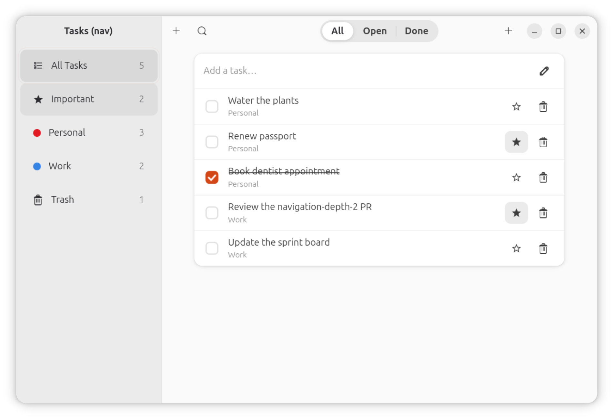
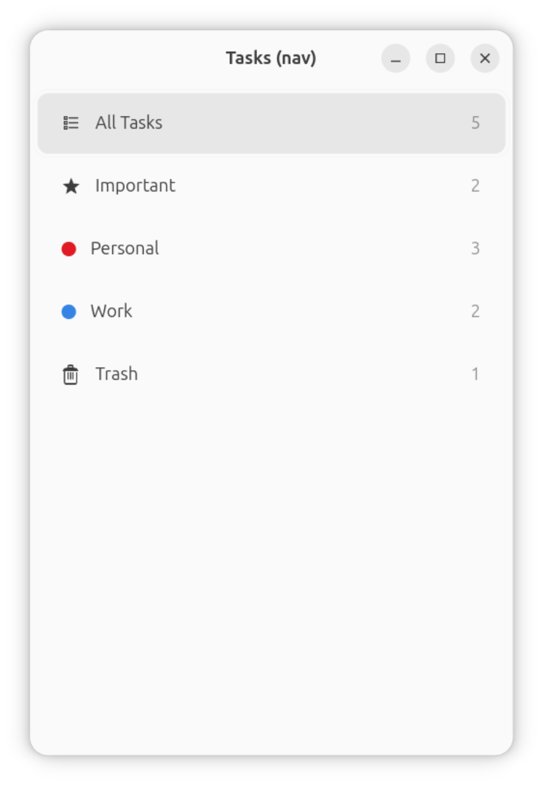
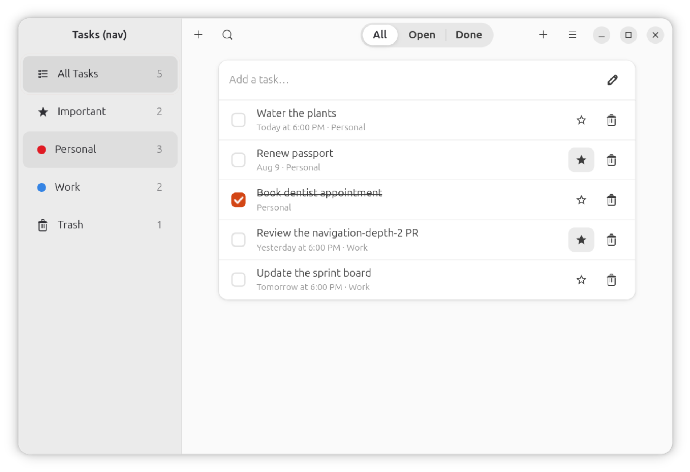
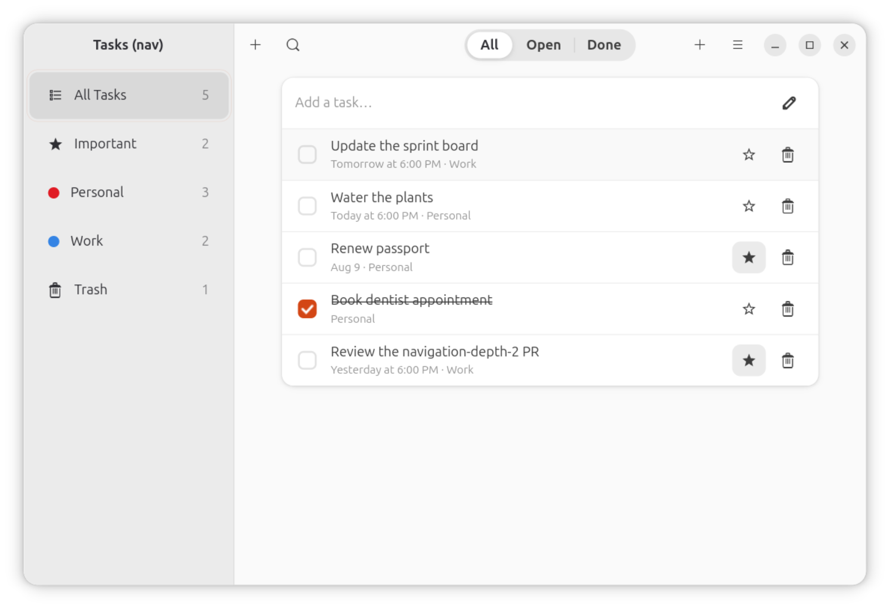

# tasks-nav — a task manager, written entirely through `createSidebarNavigator`

The proof for the `navigation-depth-2` epic: a task manager of navigational
complexity comparable to [`examples/tasks-app`](../tasks-app/README.md#why-this-is-not-built-on-createsidebarnavigatorcreatestacknavigator)
(PR #18) — smart views and colored user lists in a sidebar, a content pane
that shows a task list or an open task's editor — built **entirely through
`createSidebarNavigator`**, with no direct
`AdwNavigationSplitView`/`AdwNavigationPage`/`AdwActionRow` in the app code.

That other example is a separate, unmerged branch (`epic/tasks-app`); this
one does not depend on it, copy from it, or share a directory name with it.
It is independent: the same application twice, one built by hand from
Adwaita widgets and one from the navigator, which is only a useful
comparison if they are actually the same application — so the features
that were parked while the navigator was still being proven are here too
now: drag-reorder, due dates, sorting, dialogs and shortcuts first, then
file-backed storage, reminders, toasts, a "New List" dialog, a "Today"
smart view and task notes. See "Where it still differs from tasks-app"
for what is left, and why each difference is deliberate.

|  |  |
| :------------------------------------------------------------------------------------------------------------------------------------------: | :---------------------------------------------------------------------------------------------------------------: |
|                                                                     wide                                                                     |                                       collapsed below `collapseWidth={500}`                                       |

## Run it

```sh
npm install          # from the repo root (workspaces)
cd examples/tasks-nav
npm run dev           # gtkx dev — vite + Fast Refresh
npm run build && npm start   # release bundle
```

## What it demonstrates

Every one of the three gaps `examples/tasks-app`'s README named, closed on
`createSidebarNavigator` itself (see `docs/api.md` and
`docs/research/navigation-extensibility.md` for the mechanism behind each):

- **Sidebar row metadata**: `SidebarNavigationOptions.icon`/`color`/`count`.
  Smart views (All Tasks, Important, Trash) carry an Adwaita symbolic icon;
  user lists carry a colored dot instead; every row's count is a live badge
  recomputed from the store on every render.
- **Dynamic screens**: user lists are genuinely dynamic — the "New List"
  dialog (the `+` in the SIDEBAR header) adds a `Sidebar.Screen` the very
  next render. `createSidebarNavigator` is built on `TabRouter`, and this
  is the proof it tolerates a changing screen set, not just a fixed tab
  bar.
- **A customizable sidebar header**: that `+` sits in the sidebar pane's
  own `AdwHeaderBar` through `sidebarHeaderLeft` — see "The sidebar
  header" below for why it used to be somewhere much worse.
- **Native collapse**: `collapseWidth={500}` — below 500sp the split view
  collapses to one column through a native `Adw.Breakpoint`, not a
  `useWindowDimensions` conditional (see `docs/architecture/layout-and-styling.md`,
  "Two ways to react to size"). Selecting a row while collapsed reveals content;
  the native back button that appears returns to the sidebar.
- **A content header that changes with selection**: one screen component
  (`src/screens/content-screen.tsx`) renders THREE different header shapes
  depending on its own local state — a filter toggle group (All/Open/Done)
  for a list, a plain title for Trash, a back button plus star/delete for
  an open task — all through `SidebarNavigationOptions.headerLeft`/
  `headerRight`/`headerTitle` and `navigation.setOptions()` called from an
  effect. Opening a task is a conditional render inside this ONE screen,
  never a push — exactly how `examples/tasks-app`'s own tutorial-derived
  content pane works, and exactly why `createStackNavigator` was never the
  right tool for it. No stack is used anywhere in this app.

## Drag-and-drop reorder

Rows are dragged into a new order with GTK4's own drag-and-drop, and the
rows themselves are **written in React Native** — a `Droppable` around a
`Draggable` per row (`src/components/task-row.tsx`) inside one
`DropProvider`, all from
[`react-native-gtkx/dnd`](../../docs/api.md#drag-and-drop-react-native-gtkxdnd),
which mirrors `react-native-reanimated-dnd`. The drag icon is
`Gtk.WidgetPaintable` of the row itself, the payload is the task id as a
`GObject` string value, and the drop calls the store's `reorder`.

It used to be two lines — `onReorder` on a `List` and `reorderId` per
`ListRow` — and those are gone, deliberately. They were a second entry
point into the same module `Draggable` and `Sortable` come from, so an app
had two unrelated-looking ways to start a drag. **This is more code, and
that is the trade:** about a dozen lines here instead of two, in exchange
for the only drag-and-drop API in the platform being the one an RN
developer already knows. `src/components/task-row.tsx` says the same thing
at the call site.

Why the id-keyed pair rather than `Sortable`: `Sortable` owns an array and
renders its own `ScrollView`, and this screen's order lives in the store,
which filters and sorts it — and the list already sits inside a `ScrollView`
with an "Add a task" row above it that must not be draggable. Ids are what
this app can express.

That combination did not exist when this example first shipped: a
`Pressable` exposes no widget, so a GTK event controller could not be
attached to a React Native row at all, and the rows had to be
`AdwActionRow`s. `Controllers` from `react-native-gtkx/gtk` is the door that
closed it, and `react-native-gtkx/dnd` is written on top of it — see
`docs/architecture/integration.md` and
`docs/research/react-native-first-showcase.md`.

**The boxed list itself is an app component now.** `src/components/list.tsx`
is `List`/`ListRow`/`ListSeparator` — the `.boxed-list` frame, the
separators, the corner radii, both tints and the focus ring, measured out of
libadwaita's own stylesheet and written in `View`/`Pressable`/`Text`. It used
to live in `react-native-gtkx/common`; it does not, because that subpath does
not resolve on iOS or Android either, so it bought a shared screen nothing
over `AdwActionRow` while costing a hand-maintained copy of metrics that move
with libadwaita. Copy the file if you want this look; reach for
`react-native-gtkx/adw` if you want the real widget.

|  |  |
| :-------------------------------------------------------------------------------------------------------------------------------------------------------------------------------------------------: | :-----------------------------------------------------------------------------------------------------------------------------------------------: |
|                                                                         before — the last row is "Update the sprint board"                                                                          |                                 after dragging it onto the first row, with a real pointer in a real GNOME session                                 |

**Why not a React Native drag library.** `react-native-draggable-flatlist`
and every relative of it are built on `react-native-gesture-handler` plus
`react-native-reanimated`. When this screen was written the platform
implemented neither and aliased neither, so they failed at import rather than
at runtime. Reanimated is implemented now
(`react-native-gtkx/reanimated`), but RNGH's `GestureDetector` is not, so
those libraries remain blocked — on one dependency instead of two. A hand-rolled JS
drag is blocked one level lower: `View` has no touch or responder props at
all (only `Pressable`'s discrete press/hover, whose event carries just
`{x, y}`), and there is no `measure()`/`measureInWindow` to turn a row's
rect into window coordinates — the two things any JS drag needs. So the
choice was not "native vs. library", it was "native or build the RN gesture
stack first".

Even with both available, GTK's own drag-and-drop would still be the right
call for this app: it brings a real drag icon, correct cursors and GDK's
content negotiation (so a drop can cross widgets, or come from another
application) for free. The honest cost is portability — this path is
Linux-only, and an app sharing this screen with iOS/Android would take the
RN route instead. What the platform now guarantees is that the cost is
_visible_: the reorder lives behind `react-native-gtkx/common`, and the
escape hatch beneath it is imported from `react-native-gtkx/gtk`, so a file
that cannot run on iOS says so in its imports rather than compiling and
quietly doing nothing.

**When dragging is off.** `isReorderable` (`src/selectors.ts`) makes each row
render bare — no `Droppable`, no `Draggable`, and so no drag controllers at
all — everywhere a drop would not mean anything: manual sort order, no active
search, not Trash. A drop under "sort by due date" would be overwritten by
the sort on the very next render; a search result is a projection with gaps,
so "put it here" has no single answer; and Trash is not a place to arrange
things. Same three conditions as `examples/tasks-app`'s own predicate, and
they are unit-tested (`tests/unit/selectors.test.ts`) rather than left to a
screenshot.

## Persistence

Tasks survive a restart, in `$XDG_DATA_HOME/dev.rngtkx.tasksnav/tasks.json`
(`src/storage.ts`). Preferences keep going through GSettings — a SETTINGS
store and a DOCUMENT store are different things, and dconf is not a place
to put user data.

Three failure modes get deliberate handling, because each one silently
destroys a user's tasks if left to chance:

- **A crash mid-write.** The naive `writeFileSync(file, json)` truncates
  first and writes second, so a crash between the two leaves a zero-length
  file and the next launch seeds over the top of it. Every save writes a
  sibling temp file and `rename(2)`s it over the real one; rename is
  atomic within a filesystem, so the next launch sees either the complete
  old file or the complete new one, never a torn one. Deliberately NOT
  `fsync`ed first: that buys power-loss durability rather than
  crash-atomicity, and costs a disk flush on every keystroke in the Notes
  field. Crash-atomicity is the failure this app can actually hit.
- **No file, or a broken one.** First run, a half-copied file, a
  hand-edited one: every read path returns null and the app seeds instead
  of throwing. An app that cannot read its save file must still start.
- **A schema that moves.** The payload sits in a versioned envelope, and
  every field is revived individually with a default rather than trusted —
  so a file written before `notes` and `completedAt` existed still loads.
  A file from a FUTURE version is refused outright, because half-reading a
  format written by a newer build is worse than starting fresh.

Only the document is written, and only when it actually changed: typing in
the search field or opening a dialog are state changes too, and none of
them should touch the disk.

One consequence worth naming: **ids had to stop being a counter.** A
counter is only safe while state starts empty every run — once the
document is restored from disk, a fresh `task-1` on the next launch
collides with the `task-1` the previous launch saved, and `tasks.find(id)`
matches whichever came first. That is the same defect #33 found with seed
data, now reachable with no fixture at all. `crypto.randomUUID()` removes
the class rather than dodging it, and is what `examples/tasks-app` already
used.

## Where it still differs from tasks-app

Two rows exist in this app's task editor that tasks-app has no need for,
and both are consequences of the navigator rather than taste:

- **Done.** tasks-app completes a task with the row's checkbox, which
  stays on screen because its editor sits in a pane beside the list. Here
  the editor REPLACES the list inside one screen, so that checkbox is not
  reachable while a task is open — without the switch there would be no
  way to complete the task you are looking at.
- **List.** Smart views mix lists together, and in the list body that is
  covered by the row subtitle. The editor has no subtitle to borrow.

Everything else — notifications and reminders, toasts, file-backed
storage, the "New List" dialog, the "Today" smart view, notes and the
created/completed timestamps — now matches.

## The sidebar header

Everything the PRD's checklist named — row metadata, a dynamically
changing screen set, native collapse, and a per-selection content
header — was expressible through `createSidebarNavigator`'s options after
the `navigation-depth-2` epic.

One smaller thing was not, and this app worked around it: **the sidebar
PANE's own chrome was not customizable.** Its `AdwToolbarView`'s
`AdwHeaderBar` was hard-coded (`<AdwHeaderBar />`, no props), so the only
thing a navigator consumer could set on it at all was `sidebarTitle` (a
plain string). This app's "New List" action wanted to live there —
matching upstream's own tutorial, and `examples/tasks-app`'s
`SidebarHeader`, where the sidebar header carries the "add list" button —
and had to go on the CONTENT header instead.

That workaround turned out to be worse than "not where we'd have put it".
The content header already carries **New Task**, also a `+`, so the window
showed **two identical plus buttons side by side** with nothing to tell
them apart — one adding a task, one adding a list. A user reported exactly
that.

Fixed in the navigator rather than worked around again here:
`sidebarHeaderLeft` / `sidebarHeaderRight` / `sidebarHeaderTitle`
(navigator props, `() => ReactNode`), mirroring the content header's own
`headerLeft`/`headerRight`/`headerTitle` instead of inventing a narrower
shape. Note this is a different axis from the `sidebar-open-api` epic's
`sidebarRow`/`sidebarContent`: those replace the pane's BODY, and
neither was ever aimed at its `AdwHeaderBar`.

They take arbitrary content, not a button list — a sidebar header
is also where a search entry, a menu or a spinner would go, and a
`HeaderButton[]` convenience could not express any of those. They are
navigator PROPS rather than screen options because there is one sidebar
pane shared by every screen, which is the same level `sidebarTitle` and
`sidebarContent` already sit at. See `docs/api.md`.

## Verified live

Built and launched in the VM's real GNOME session
(`node scripts/vm.ts app examples/tasks-nav`), not just headless tests —
and it caught a real bug headless tests did not: the first live screenshot
showed every row's task title missing, only the list-name badge visible.
Root cause: `ScrollView`'s content defaults to `alignItems: "flex-start"`,
so each row hugged its own content width instead of stretching to the
screen's width, and the title `Text`'s `flex: 1` (`flexBasis: 0`) had no
free space to grow into inside a non-stretched parent — the exact gotcha
`examples/gallery`'s own styles already document for its ScrollView
sections. Fixed with `contentContainerStyle={{ alignItems: "stretch" }}`;
confirmed fixed with a second screenshot (both above are post-fix).

Mouse-driven verification hit the same HiDPI coordinate-scaling issue
`examples/tasks-app`'s README already recorded for this VM session, so
interaction was driven by keyboard instead (`Tab`/`Enter`, GTK's own
focus-follows-tab through the sidebar's `GtkListBox`), the same workaround
that example used successfully for its own live pass:

- **Sidebar navigation**: tabbing between rows changes the active screen
  live (confirmed twice, deterministically) — counts, colors and the
  content pane all update correctly.
- **Dynamic screens**: activating the header's "New List" button added a
  new colored row (`List 3`, the next palette color) immediately, live —
  the `createSidebarNavigator`/`TabRouter` dynamic-screen-set claim, not
  just asserted in `examples/tasks-nav`'s design but actually exercised.
- **Trash / restore**: tabbing into Trash's content and activating a row
  restored it live — the count moved from Trash back into All Tasks and
  its list, and the empty state ("Trash is empty") rendered correctly
  once Trash had nothing left in it.
- **Collapse**: launched at a width below `collapseWidth={500}` (400),
  the split view showed the sidebar alone, matching the automated GTK
  test's headless resize exactly (`tests/gtk/navigation/sidebar-collapse.gtk.test.tsx`).
- **Collapsed selection and back** (the `collapse-nav` epic — the
  maintainer-reported bug this fixed): launched already below
  `collapseWidth` (420), confirmed sidebar-only, no content — matching the
  "cold start defaults to the sidebar" finding in
  `docs/research/navigation-extensibility.md`. Pressed Down twice
  (keyboard, no mouse): the active screen changed to "Important" AND the
  content pane opened with the native back chevron, live — this is the
  `state.index` effect's `showContentIfCollapsed()` call, the actual fix
  (a plain `navigate()` with no row click reveals content, where it
  previously did not). Pressed Escape: back to the sidebar, "Important"
  still the selected row — the split view's own back affordance, with
  react-navigation state provably untouched. Both states screenshotted.

**Not verified live in this pass**, for lack of a reliable pointer in this
VM session rather than any known defect: opening a task's detail editor
and the header swapping to back/star/delete. That exact mechanism
(`navigation.setOptions` swapping `headerLeft`/`headerRight`/`headerTitle`)
is covered by
`tests/gtk/navigation/sidebar-dynamic-header.gtk.test.tsx`, which drives
the identical code path this screen uses — it asserts the header content
itself changes, not just that the option was accepted — but that is a
headless assertion, not a live one. Re-activating the SAME already-selected
row after going back (needs re-focusing the row first, which the keyboard
sequence used for the collapse pass above did not do) is likewise only
covered headlessly, by the pre-existing
`tests/gtk/navigation/sidebar-collapse.gtk.test.tsx` test for it.

**Found live, unrelated to collapse-nav, not fixed**: a small `+`-only
control renders in its own thin strip above both the sidebar's and the
content's own `AdwHeaderBar`s, under `chrome: "content"`. Present on the
very first paint at the default width, before any collapsing or
navigation, so it predates and is independent of the `collapseWidth`
work — most likely a `chrome: "content"` window-chrome detail, not
anything in `createSidebarNavigator` itself. Not investigated further;
recorded here rather than silently left unmentioned.

### The parity pass (drag-reorder, due dates, sorting, dialogs, shortcuts)

Driven with a real pointer this time, not the keyboard, because a drag
cannot be proven any other way. The "HiDPI coordinate-scaling issue" the
pass above (and `examples/tasks-app`'s README) recorded turned out to be
ydotool's own documented requirement rather than anything about this
session: `mousemove --absolute` is implemented as a homing move plus a
relative one, so pointer acceleration bends it — its `--help` says so
outright. With `org.gnome.desktop.peripherals.mouse accel-profile` set to
`flat`, absolute coordinates land exactly, in LOGICAL desktop pixels
(this session: a 2560×1600 mode at scale 1.25, so a 2048×1280 space).
Calibrated by clicking a sidebar row and checking the app switched to it.
Anyone repeating this should set the flat profile first and restore it
afterwards.

- **Drag reorder**: dragged the last row ("Update the sprint board") onto
  the first — button down on the row, relative moves up the list, release
  over the target. It landed first, and its star/trash state came with
  it. Both screenshots are the pair shown under "Drag-and-drop reorder"
  above.
- **The drag gate**: with Sort order switched to "Due date" in
  Preferences, the byte-identical drag changed nothing — no
  `GtkDragSource` is attached at all in that state.
- **Sorting**: switching to "Due date" re-sorted the list live
  (yesterday → today → tomorrow → next week → undated last), through
  GSettings, and survived the dialog closing.
- **Preferences / Shortcuts / delete confirmation**: all opened and
  worked. `Ctrl+?` opened the Shortcuts window (so `actionAccels` and the
  `win.*` actions are really registered, not just declared); the Trash
  row's permanent-delete button raised the confirmation, and confirming
  emptied Trash down to its empty state.
- **`Ctrl+N` and `Escape`**: Ctrl+N added a task and opened its editor;
  Escape closed the editor back to the list.

**Two things this pass found that no test had:**

1. `Ctrl+N` added a task and then opened **the wrong one** — "Water the
   plants" instead of the task it had just created. The id counter starts
   at zero, so the first generated id was `task-1`, which was already a
   seeded task's id, and `tasks.find(id)` matched the seed first. A
   pre-existing bug in this example, invisible until something actually
   created a task and navigated to it. Fixed by giving seeds their own
   `seed-*` namespace, disjoint from generated ids by construction rather
   than by counting.
2. `windowActions`/`windowControllers` render as props of the window
   `AppRegistry.runApplication` builds — **siblings of the app's own tree,
   not descendants**. No React context from inside the app could reach them,
   so this example's Context store had to become a module-level external
   store (`useSyncExternalStore`) before `Ctrl+N` could add a task at all.
   Not a defect — those elements have to exist before the app mounts — but
   a real constraint on any app that wants window actions, and one
   `examples/tasks-app` never met because zustand is module-global anyway.

   **Since fixed at the platform level, and every workaround it forced is
   gone.** `<WindowActions>`/`<ApplicationActions>`/`<WindowControllers>`
   ([`react-native-gtkx/gtk`](../../docs/architecture/integration.md#actions-and-shortcuts-declared-in-the-tree))
   declare the same things from inside the app tree, so this example's store
   is an ordinary Context + `useReducer` again (`src/store.tsx`), its toast
   overlay is an ordinary context provider (`src/toast.tsx`) rather than a
   module-level slot, `requestDeleteTask` is a hook again, and the actions
   read the store through the same `useStore()` every screen uses
   (`src/components/window-chrome.tsx`). The options still work and are
   deprecated.

### The second parity pass (storage, reminders, toasts, New List, Today, notes)

Driven in the VM's real GNOME session, keyboard where possible (a shared
VM with five other agents on it kept stealing pointer focus mid-sequence,
so anything that could be done with a key was):

- **The two plus buttons**: the sidebar `+` now sits in the sidebar
  header, next to "Tasks (nav)", with New Task on the content header —
  the placement the tutorial and `examples/tasks-app` both use.
- **Persistence, across a real process restart**, not a mocked one:
  `Ctrl+N` added a task, `Delete` trashed it, then the app was stopped and
  started again. Trash came back reading **2** where the first launch had
  read 1, and the save file on disk carried the versioned envelope with no
  `.tmp` left beside it. The seed fixture was NOT re-applied.
- **Toasts**: `"New Task" moved to Trash` with an **Undo** button,
  raised by the **Delete key** — which lives in `AppShortcuts`. At the time
  that was mounted as `windowControllers`, OUTSIDE the app's tree, which is
  why the overlay was reached through a module-level slot rather than a
  context; `<WindowControllers>` has since put it back in the tree and
  `src/toast.tsx` is a plain provider again.
- **The task editor**: Notes and the Created timestamp render, and
  `Ctrl+N` opened the task it had just created rather than a seeded one —
  the id-collision fix from #33 still holding now that ids are random.
- **The "New List" dialog**: heading, name entry, six color swatches and
  Cancel/Add. This is where a real bug turned up — see below.
- **Reminders**: a task patched to fall inside the 30-minute lead window
  produced a genuine GNOME notification banner — "Tasks (nav) · Just now /
  Water the plants / Due Aug 1, 2026, 10:32 AM".

**Found live, fixed:** the New List dialog first came up as a bare entry
and six swatches — **no heading and no Cancel/Add buttons at all**.
`AdwAlertDialog` composes its own layout (heading, body, responses) into
`Adw.Dialog:child`, which is what plain JSX children bind to, so passing
children REPLACES that whole layout. libadwaita's own slot for extra
content is `extra-child`, exposed by the bindings as `extraChild`. Not a
platform gap — the right prop already existed — but the failure is silent
and total. `examples/tasks-app`'s copy of this dialog had the identical
defect, never having been opened on screen in any verification pass; fixed
there too.

**Not verified live:** clicking **Add** to actually create a list.
Another session's app on the shared VM reclaimed pointer focus on every
attempt, so the keystrokes landed in the wrong window (confirmed by
reading the save file back — no list was created). The dialog itself is
screenshotted above, and `addList`'s behaviour, including its rejection of
an empty name, is unit-tested; the final click is not proven on screen.

**A deployment requirement, found the hard way:** the reminder fired only
after installing a `~/.local/share/applications/dev.rngtkx.tasksnav.desktop`
entry. GNOME Shell's `org.gtk.Notifications` implementation silently drops
notifications from an application id with no matching desktop entry —
nothing is logged, the call simply has no effect. The first attempt showed
"No Notifications" in the tray with a clean app journal, which is exactly
how this looks when it bites. Anything shipping `GNotification` needs a
desktop entry installed; neither example installs one, so a developer
running either from source will see reminders do nothing until they add
it.

## Attribution

Application concept (smart views, colored lists, a task editor) inspired by
the [gtkx tutorial](https://gtkx.dev/tutorial/)'s Tasks app, the same
public source `examples/tasks-app` ports — no code or assets are shared
between the two examples or copied from either upstream project.
