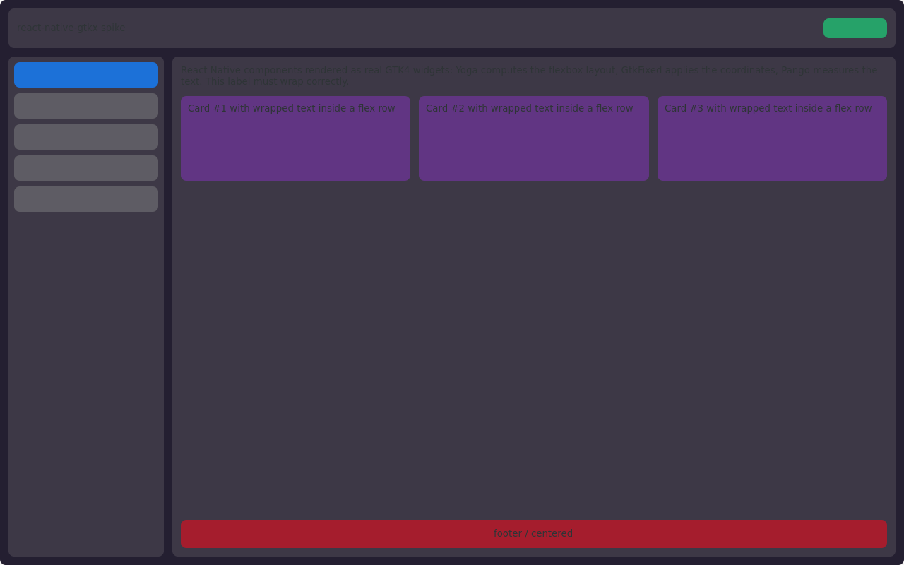

# Спайк Yoga + GtkFixed — результаты

Дата: 2026-07-28. Среда: контейнер `rn-gtkx-dev` (Ubuntu 26.04, GTK 4.22.4, libadwaita 1.9.1, Node 24.18) на удалённом Linux-хосте (6 CPU), headless Xvfb 1280×800. Версии: @gtkx 1.0.0-rc.1, yoga-layout 3.2.1, react 19.2.8.

## Решение: **GO**

Архитектура «Yoga на JS-стороне + императивное позиционирование в GtkFixed» подтверждена по всем пунктам. Запас по производительности — на два порядка выше бюджета.

## Замеры

| Проверка                                                                                                  | Результат                                                                                   | Бюджет  | Вердикт                          |
| --------------------------------------------------------------------------------------------------------- | ------------------------------------------------------------------------------------------- | ------- | -------------------------------- |
| Точность раскладки (23 виджета, вложенный flexbox: row/column, flex, gap, padding, space-between, center) | maxDelta = **0 px**                                                                         | ±1 px   | ✅                               |
| Точность текста (12 кейсов: 3 текста × ширины 120/200/320/480, перенос строк)                             | maxDelta = **0 px**                                                                         | ±1 px   | ✅                               |
| Reflow Yoga-дерева 500 узлов (100 проходов с изменением стиля)                                            | **0.13–0.17 мс**                                                                            | ≤ 16 мс | ✅ (запас ~100×)                 |
| Анимация 100 виджетов, прямой путь (`fixed.move()` в tick callback)                                       | **60.0 fps**                                                                                | 60 fps  | ✅ (упор в кап Xvfb)             |
| Анимация 100 виджетов через React-state (setState → рендер → layoutEffect → 100 move)                     | **57.4 fps**                                                                                | —       | ✅ (даже worst-case путь у цели) |
| Визуальная проверка                                                                                       | `shots/static.png` — header/sidebar/cards/footer, переносы текста, скругления через GTK CSS | —       | ✅                               |

Скриншот: 

## Подводные камни gtkx rc.1 (вход для задачи 003)

1. **Декларативный `GtkFixedLayoutChild` в rc.1 не работает**: механизм ленивого резолва layout-child через `layoutManager.getLayoutChild()` появился в main уже после rc.1 (в rc.1 создаётся «оторванный» объект → Gtk-CRITICAL «layout-manager property not set», позиции не применяются). Решение: позиционировать **императивно** — `fixed.move(child, x, y)` через refs (дети добавляются реконсилером через `fixed.put(child, 0, 0)`). Это и есть целевой путь layout-движка (диффинг координат + пакетные move), так что ограничение нам не мешает. RN `transform` (scale/rotate) при необходимости — императивно через `fixed.getLayoutManager().getLayoutChild(widget).setTransform()` из gi-биндингов. При обновлении gtkx до следующего RC перепроверить.
2. **64-битные значения из FFI приходят BigInt'ом**: `frameClock.getFrameTime()` → BigInt; арифметика с number кидает TypeError. Bridge должен нормализовать (`Number(...)`) на границе.
3. **Измерение текста**: офскрин `new Gtk.Label()` (wrap=true) + `measure(VERTICAL, forWidth)` работает синхронно до маунта и совпадает с фактическим рендером в 0 px — идеальная measure-функция для Yoga.
4. `widget.measure()` возвращает кортеж `[min, nat, minBaseline, natBaseline]`.
5. A11y-warning «Unable to acquire accessibility bus» в headless — шум; в тестах ставить `GTK_A11Y=none`.
6. Инфраструктура: осиротевший `dbus-daemon` держит stdout-пайп контейнера (вывод приложения — в файл, daemon добивать).

## Что не проверено (низкий риск, отложено)

- Живой ресайз окна с оценкой «дребезга» — headless-скриншоты этого не показывают. Составные операции ресайза (reflow 0.17 мс + пакет move при 60 fps) уже измерены; событие ресайза берётся из `useProperty` окна. Проверить глазами при первом live-запуске (XQuartz/Wayland).
- React-state путь анимации деградирует до 57.4 fps на 100 виджетах — для Animated использовать прямой путь (так и планировалось в 009).
